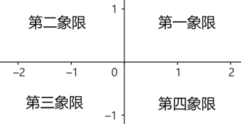
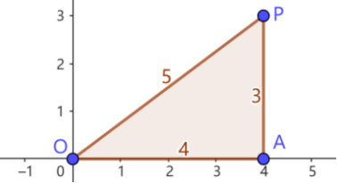
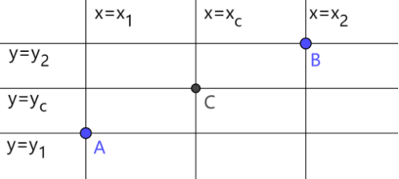
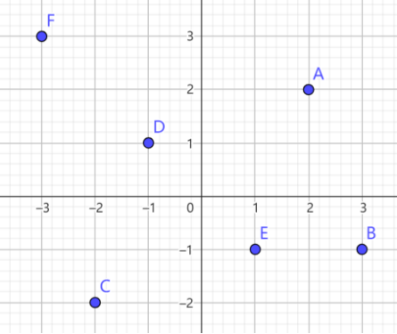
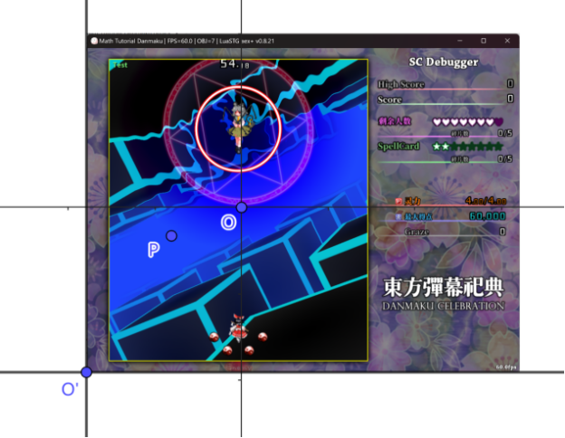

# 1.1 平面直角坐标系

平面直角坐标系是我们在数学中经常使用的一个重要工具。它提供了一种简洁而通用的方式来描述平面上点的位置以及点与点的关系。本节将介绍平面直角坐标系的基本概念，建立对坐标系的直观认识。

## 1.1.1 平面直角坐标系

如下图，平面直角坐标系可以看作是平面上的一个网格系统。它有水平和竖直的两条基准线，称为 **坐标轴**。水平的坐标轴称为 **横轴** 或 **x轴**，竖直的坐标轴称为 **纵轴** 或 **y轴**。两条坐标轴相交于一点，称为 **原点**，一般记作点 $O$。我们可以用 $xOy$ 来表示这个坐标系。

在平面直角坐标系中，每个点都可以用唯一的有序数对 $(x,y)$ 表示。对于上图的点 $P$，作图示矩形 $OAPB$，点 $A$ 在 $x$ 轴上对应的数为 $-1$，点 $B$ 在 $y$ 轴上对应的数为 $1.5$，那么点 $P$ 就可以用有序数对 $(-1,1.5)$ 表示。我们称 $-1$ 为点 $P$ 的 **横坐标**，$1.5$ 为点 $P$ 的 **纵坐标**，$(-1,1.5)$ 为点 $P$ 的 **坐标**。

根据横纵坐标的正负性，可以将平面划分为四个区域 (不包括坐标轴和原点)，分别记为第一、二、三、四 **象限**。

## 1.1.2 坐标的几何含义

前文中我们用构造矩形的方式解释了坐标的含义。针对各种实际问题，我们可以用不同方式理解坐标的含义。

### 1) 构造直角三角形

在解决弹幕相关的几何问题时，我们经常需要构造直角三角形。直角三角形与平面直角坐标系联系紧密，又具有十分简洁的边角关系。直角三角形的边角关系将在下一节详细讨论。

例 1：已知平面上一点 $P(4,3)$，求线段 $OP$ 的长度 $|OP|$。

构造下图所示的直角三角形 $OAP$，由点 $P$ 坐标可得线段 $OA, OP$ 的长度 $|OA|=4, |AP|=3$。由勾股定理 (下一节介绍) 可得 $|OP|=5$。

### 2) 十字准星

对平面上的任意一点 $P$，可以由过该点的水平线和竖直线确定该点位置。在水平线上，所有点的纵坐标相等，设为 $y_p$；在竖直线上，所有点的横坐标相等，设为 $x_p$。我们将该水平线记为 $y=y_p$，竖直线记为 $x=x_p$。若已知 $x_p$ 和 $y_p$，则交点 $P$ 的坐标就为 $(x_p,y_p)$。

例 2：已知平面上的两点 $A(x_1,y_1), B(x_2,y_2)$，求线段 $AB$ 的中点 $C$ 的坐标。

设点 $C$ 的坐标为 $(x_c,y_c)$。如下图，点 $A,B$ 的水平线分别为 $y=y_1,y=y_2$。中点 $C$ 的水平线应当夹在两水平线之间，且与两水平线的距离相等。于是有

$$
y_2-y_c=y_c-y_1
$$

解得 $y_c=\dfrac{y_1+y_2}{2}$。同理有 $x_c=\dfrac{x_1+x_2}{2}$。点 $C$ 的坐标为 $(\dfrac{x_1+x_2}{2},\dfrac{y_1+y_2}{2})$。

### 3) 平移

点的坐标也与从原点到该点的平移对应。设有一点从原点出发，向右平移 $x$ (或向左平移 $-x$ )，再向上平移 $y$ (或向下平移 $-y$ ) 到达点 $P$ 位置，则点 $P$ 的坐标为 $(x,y)$。

类似地，将点 $P(x,y)$ 向右平移 $\Delta x$ (或向左平移 $-\Delta x$ )，再向上平移 $\Delta y$ (或向下平移 $-\Delta y$ )，所得点的坐标为 $(x+\Delta x,y+\Delta y)$。

## 习题

1. $x$ 轴上的点，坐标有什么特点？$y$ 轴上的点，坐标有什么特点？

2. 写出下图中各点的大致坐标，并判断它们分别在哪个象限。

    

3. 已知平面上一点 $P(x_0,y_0)$ 和水平线 $y=y_1$，求点 $P$ 关于该水平线的对称点的坐标。

4. 如下图，设版面内有一点 $P(x_p,y_p)$。以 `UI` 左下角 $O'$ 为原点，建立平面直角坐标系 $x'O'y'$，该坐标系的单位长度与标准系相等。若在 $x'O'y'$ 系下点 $O$ 的坐标为 $(224,240)$，求点 $P$ 在 $x'O'y'$ 系的坐标。

    
