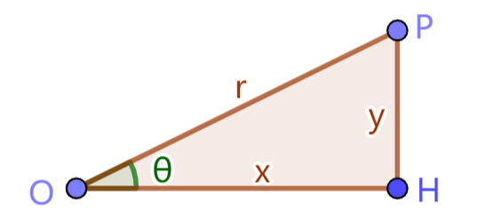
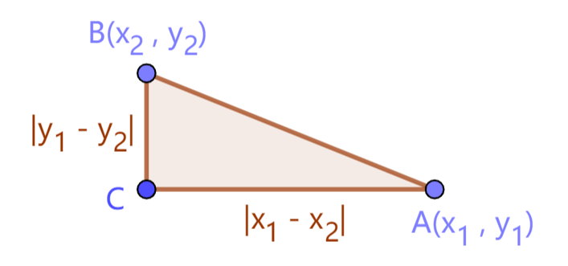
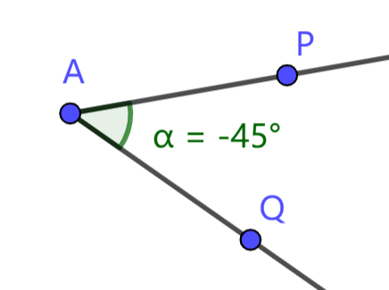
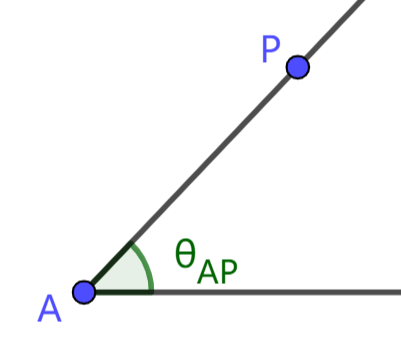
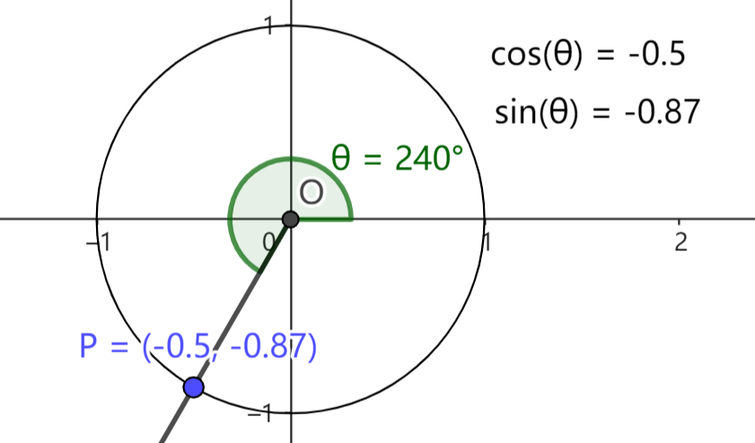
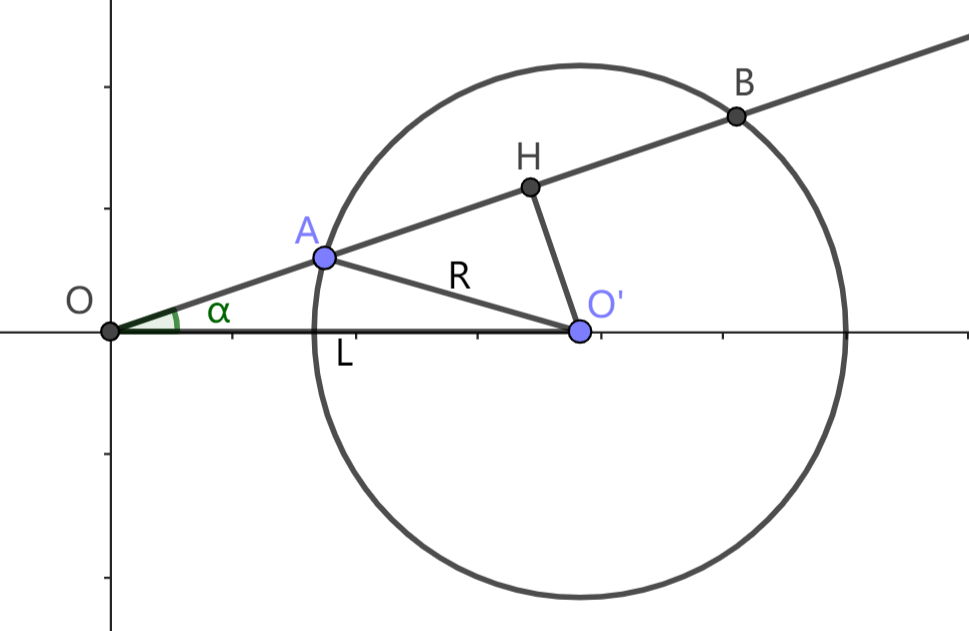

# 1.2 直角三角形的边角关系

直角三角形在坐标相关的问题中有着重要的应用。为了应用直角三角形解决实际问题，我们需要知道直角三角形的一些几何性质。这一节我们将探索直角三角形的边与内角之间的联系。

如下图所示，在直角三角形 $OHP$ 中，点 $O,H,P$ 称为三角形的顶点，角 $\angle O$ (或 $\angle POH$)、$\angle H$ (或 $\angle OHP$)、$\angle P$ (或 $\angle OPH$) 称为三角形的内角。对于三个内角，总有 $\angle O + \angle P = \angle H = 90\degree$，所以只研究一个内角 $\angle O$ 即可。

设上图三角形 $OHP$ 的三边长度 $|OH|=x, |PH|=y, |OP|=r$，内角 $\angle O=\theta$。对直角三角形性质的介绍将围绕该直角三角形进行。

## 1.2.1 勾股定理

勾股定理描述了直角三角形中三条边的长度之间的关系。文字表述为：直角三角形的 **斜边长度的平方** 等于 **两直角边长度的平方之和**。具体到直角三角形 $OHP$，勾股定理表述为

> $$
r^2 = x^2 + y^2
> $$

对平面上两点 $A(x_1,y_1), B(x_2,y_2)$，作下图所示直角三角形 $ABC$，$AC$ 沿水平方向，$BC$ 沿竖直方向。由 $A,B$ 坐标可得两直角边的长度 $|AC| = |x_1-x_2|, |BC| = |y_1-y_2|$ ( $|x|$ 表示 $x$ 的绝对值)。由勾股定理得，

> $$
\begin{array}{rl}
   |AB| &= \sqrt{|AC|^2+|BC|^2}
   \\
   &= \sqrt{(x_1-x_2)^2 + (y_1-y_2)^2}
\end{array}
> $$

这就是平面上两点的距离公式。为方便表述，我们引入 `LuaSTG` 的 `Dist` 函数。用 $\text{Dist}(x_1,y_1,x_2,y_2)$ 表示点 $(x_1,y_1), (x_2,y_2)$ 之间的距离；$\text{Dist}(A,B)$ 表示 $A,B$ 两点之间的距离，即 $|AB|$；另外规定 $\text{Dist}(x,y)$ 为点 $(x,y)$ 与原点之间的距离，即 $\text{Dist}(x,y)=\text{Dist}(0,0,x,y)$。

## 1.2.2 锐角三角函数

三角函数描述了直角三角形的内角与三边之间的联系。对直角三角形 $OHP$，若固定 $\theta$ 为某个定值，我们发现，无论 $OHP$ 的边长如何变化，三边的长度始终呈现某种固定的比例关系，这个比例与 $\theta$ 有关。为了描述这种比例关系，我们定义以下三个函数：

> 余弦函数 $\cos(\theta) = \dfrac xr$
> 
> 正弦函数 $\sin(\theta) = \dfrac yr$
> 
> 正切函数 $\tan(\theta) = \dfrac yx$

这三个函数合称 **三角函数**。根据上述定义，$OHP$ 三边比例为

> $$
x : y : r = \cos(\theta) : \sin(\theta) : 1
> $$

## 1.2.3 任意角

研究直角三角形时，我们对角度的讨论仅限于锐角 ( $0\degree$ 到 $90\degree$ )。而在 `LuaSTG` 中描述方向、转速等属性等，角度能够取任意数值。这样的角叫做任意角。我们对任意角的定义如下：

将射线 $AP$ 绕端点 $A$ 逆时针旋转 $\alpha$ (或顺时针旋转 $-\alpha$ ) 得到射线 $AQ$。由该旋转过程产生的图形称为任意角。沿用以前表示角的方法，记为 $\angle PAQ$。它的值为 $\alpha$，射线 $AP, AQ$ 分别称为 $\angle PAQ$ 的始边、终边。

在这个定义中，任意角和传统定义的区别体现在两个方面：

1. 任意角不能交换始边和终边。传统定义下我们会认为 $\angle PAQ$ 和 $\angle QAP$ 表示同一个角。但对于任意角，$\angle PAQ$ 的始边为 $AP$，终边为 $AQ$；$\angle QAP$ 的始边为 $AQ$，终边为 $AP$，二者不表示同一个角，取值互为相反数。
2. 即使两个任意角的始边、终边都相同，它们的值也不一定相等。比如在上图中，射线 $AP$ 绕点 $A$ 顺时针旋转 $45\degree$ 或逆时针旋转 $315\degree$ 都能得到射线 $AQ$，所以任意角 $\angle PAQ$ 的值可以为 $-45\degree$，也可以为 $315\degree$ 或其他相差 $360\degree$ 的整数倍的值。

如果任意角 $\alpha,\beta$ 相差 $360\degree$ 的整数倍，尽管严格来说两个角的值不一定相等，但这样的两个角在很多方面表现出相同的性质。我们定义，如果 $\alpha,\beta$ 相差 $360\degree$ 的整数倍，则称 $\alpha,\beta$ 模 $360\degree$ 同余，记作

$$
\alpha\equiv\beta\ (mod\ 360\degree)
$$

由于我们基本只讨论模 $360\degree$ 的同余，本教程将模 $360\degree$ 同余简称为 **同余**，$\alpha,\beta$ 模 $360\degree$ 同余简写为 
$$\alpha \equiv \beta$$
我们将在 `1.2.ex` 小节详细介绍这一概念。

如下图，对平面上不重合的两点 $A, P$，以射线 $Ax$ (端点为点 $A$，方向水平向右的射线) 为始边，射线 $AP$ 为终边的任意角称为 **点 $P$ 对点 $A$ 的方位角**，记作 $\theta_{AP}$。特别地，点 $P$ 对原点的方位角简称为点 $P$ 的 **方位角**，记作 $\theta_P$。

我们规定，一个点对自身的方位角可以取任意数值。

根据方位角的终边所在象限，可以将任意角划分为第一、二、三、四象限角，比如锐角为第一象限角，钝角为第二象限角。

## 1.2.4 任意角三角函数

我们可以定义任意角的三角函数。

> 如下图，在平面直角坐标系 $xOy$ 中作单位圆 (圆心为原点，半径为 $1$ 的圆)。对任意角 $\theta$，在圆上找到一点 $P(x_p,y_p)$，使得 $P$ 的方位角为 $\theta$。定义
>
> $$ \cos(\theta) = x_p $$
> $$ \sin(\theta) = y_p $$
> $$ \tan(\theta) = \dfrac{y_p}{x_p} $$

由上述定义，对平面上任意一点 $A(x_A,y_A)$，若 $OA$ 长度 $|OA|=r_A$，点 $A$ 的方位角为 $\theta_A$，则有

$$
x_A = r_A \cos(\theta_A) \\
y_A = r_A \sin(\theta_A) \\
$$

于是，由 $r_A,\theta_A$ 可以确定 $x_A, y_A$，从而确定点 $A$ 的位置。由此可以构造一种由距离 ( $r_A$ ) 和方向 ( $\theta_A$ ) 描述位置的坐标系，我们将在 1.5 节详细讨论。

## 习题

1. 填充常用三角函数表：
   |$\theta$|$0\degree$|$30\degree$|$45\degree$|$60\degree$|$90\degree$|$120\degree$|
   |:-:|:-:|:-:|:-:|:-:|:-:|:-:|
   |$\cos(\theta)$|
   |$\sin(\theta)$|
   |$\tan(\theta)$|
   
   |$\theta$|$135\degree$|$150\degree$|$180\degree$|$270\degree$|$360\degree$|
   |:-:|:-:|:-:|:-:|:-:|:-:|
   |$\cos(\theta)$|
   |$\sin(\theta)$|
   |$\tan(\theta)$|

2. 已知平面上一点 $A(x_0,y_0)$，点 $B$ 对点 $A$ 的方位角为 $\alpha$，且 $|AB|=R$，求点 $B$ 的坐标。

3. 如下图所示，点 $O'$ 位于 $x$ 轴正半轴，$|OO'|=L$，圆 $O'$ 的半径为 $R$。以原点 $O$ 为端点作倾角为 $\alpha$ 的射线 ( $-180\degree\lt\alpha\le 180\degree$ )
   1) 若 $L>R$，问 $\alpha$ 满足什么条件时，射线与圆 $O'$ 相交？
   2) 若 $L>R$，且射线与圆 $O'$ 交于 $A,B$ 两点 (图示情况)，求 $OA$ 长度。
   3) 若 $L<R$，则射线与圆 $O'$ 总有唯一交点，记交点为 $A$，试求 $|OA|$。

    