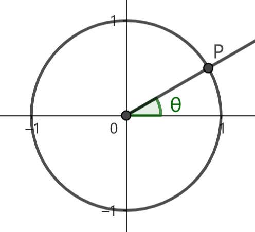
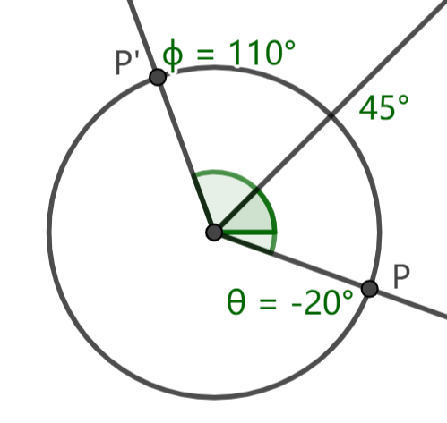

# 1.3 三角函数的运算公式

这一节将介绍三角函数的一些运算公式，主要讨论正弦 ( $\sin$ ) 和余弦 ( $\cos$ ) 的运算公式。

## 1.3.1 正切和正弦余弦的转换

> $\tan(\theta) = \dfrac{\sin(\theta)}{\cos(\theta)}$

由三角函数的定义，该公式自然成立。由于本教程基本不涉及正切函数 ( $\tan$ ) 的使用，如果读者需要知道正切的运算公式，可以用此公式把正切换为正弦和余弦之比，或把正弦和余弦之比换为正切。

## 1.3.2 正弦余弦的平方和

> $\cos^2(\theta) + sin^2(\theta) = 1$

式中 $\cos^2(\theta)$ 即为 $(cos(\theta))^2$。由三角函数的定义，点 $(\cos(\theta),\sin(\theta))$ 位于单位圆上，与原点的距离为 $1$。再由勾股定理即得该公式。

## 1.3.3 和差角公式

和差角公式是关于两个角的和或差的三角函数值的计算公式。篇幅原因本教程不会给出证明。以下给出正弦和余弦的和差角公式：

> $\sin(\alpha+\beta) = \sin(\alpha)\cos(\beta) + \cos(\alpha)\sin(\beta)$
>
> $\sin(\alpha-\beta) = \sin(\alpha)\cos(\beta) - \cos(\alpha)\sin(\beta)$
>
> $\cos(\alpha+\beta) = \cos(\alpha)\cos(\beta) - \sin(\alpha)\sin(\beta)$
>
> $\cos(\alpha-\beta) = \cos(\alpha)\cos(\beta) + \sin(\alpha)\sin(\beta)$

## 1.3.4 诱导公式

诱导公式可以看作和差角公式的特例，探讨一个角与特殊角度 ( $90\degree$ 的整数倍 ) 的和或差的三角函数值计算。

>  情况一：($k$为整数)
> 
> $\cos(\theta + k\cdot 360\degree) = \cos(\theta)$
> 
> $\sin(\theta + k\cdot 360\degree) = \sin(\theta)$

考虑单位圆上一点 $P$，其方位角为 $\theta$。我们知道点 $P$ 的坐标即为 $(\cos(\theta),\sin(\theta))$。将点 $P$ 绕原点逆时针旋转 $k$ 圈，点 $P$ 方位角变为 $\theta+k\cdot 360\degree$，而坐标不变。所以三角函数值不变。

根据该情况我们可以知道，如果两个角 $\alpha,\beta$ 同余 ( $a \equiv b$ )，那么它们的三角函数值完全相同。这是我们引入同余概念的主要原因。

> 情况二：
> 
> $\cos(\theta\pm180\degree) = -\cos(\theta)$
> 
> $\sin(\theta\pm180\degree) = -\sin(\theta)$

将点 $P$ 绕原点旋转半圈 (顺逆时针皆可) 得到点 $P'$，方位角变为 $\theta\pm180\degree$，点 $P$ 和 $P'$ 关于原点对称，所以三角函数值互为相反数。

> 情况三：
> 
> $\cos(-\theta)=\cos(\theta)$
> 
> $\sin(-\theta)=\sin(\theta)$

将 $x$ 轴非负半轴绕原点 **顺时针** 旋转 $\theta$，所得射线与单位圆交于点 $P'(\cos(-\theta),sin(-\theta))$。点 $P'$ 与 $P(\cos(\theta),\sin(\theta))$ 关于 $x$ 轴对称。

> 情况四：
> 
> $\cos(180\degree-\theta)=-\cos(\theta)$
> 
> $\sin(180\degree-\theta)=\sin(\theta)$

由情况二和情况三可以推导。

该情况下我们发现，角 $\theta$ 对应射线 ( 射线 $OP$ ) 与角 $180\degree-\theta$ 对应射线关于 $y$ 轴对称。设 $\phi=180\degree-\theta$，如果我们用 $90\degree$ 表示 $y$ 轴，则有 $\dfrac{\theta + \phi}{2} = 90\degree$。这与中点的计算是类似的。

> 情况五：
> 
> $\cos(90\degree-\theta)=\sin(\theta)$
> 
> $\sin(90\degree-\theta)=\cos(\theta)$

$\theta$ 与 $90\degree-\theta$ 关于 $45\degree$ 对称，对应的两点 $P(x,y),P'(x',y')$ 关于第一象限角平分线对称。这样的两点坐标有对应关系

$$ x'=y \\ y'=x $$

代入三角函数值即得 $\cos(90\degree-\theta)=\sin(\theta),\ \sin(90\degree-\theta)=\cos(\theta)$

> 通式：($k$ 为整数)
> 
> $\cos(\pm\theta + k\cdot 90\degree)$
> 
> $\sin(\pm\theta + k\cdot 90\degree)$

任意符合通式的表达式总能化简至 $\pm\cos(\theta)$ 或 $\pm\sin(\theta)$ 的形式。诱导公式有一句著名的记忆口诀："奇变偶不变，符号看象限"。

- "奇变偶不变"："变" 与 "不变" 指的是函数名是否需要改变。比如 $\cos(\theta+180\degree)=-cos(\theta)$，它的函数名 $\cos$ 没有改变；而 $\sin(90\degree-\theta)=cos(\theta)$ 的函数名则从 $\sin$ 变为 $\cos$。变与不变由 $k$ 的奇偶性决定。如果 $k$ 为偶数，或者说 $k\cdot90\degree$ 为 $180\degree$ 的整数倍，那么函数名不需要改变，否则函数名需要改变，从 $\sin$ 变为 $\cos$，或者从 $\cos$ 变为 $\sin$。

- "符号看象限"："符号" 指的是化简结果的正负号。$\cos(\theta)$ 和 $\sin(\theta)$ 对应正号，$-\cos(\theta)$ 和 $-\sin(\theta)$ 对应负号。正负号取决于 $\pm\theta+k\cdot90\degree$ 的 "象限"。假定 $\theta$ 为第一象限角 (即使实际上不可能)，判断原式的正负性。若原式大于 $0$，则结果取正号；若原式小于 $0$，则结果取负号。

例：$\cos(270\degree+\theta)$

- 函数名：$270\degree$ 不是 $180\degree$ 的整数倍，函数名变为 $\sin$；
- 正负号：假定 $\theta$ 为第一象限角，比如让 $\theta=30\degree$。$\cos(270\degree+30\degree)=cos(300\degree)>0$，化简结果取正号。

所以 $\cos(270\degree+\theta) = \sin(\theta)$

## 习题

1. 设有一颗子弹在版边发生反弹，已知该子弹在反弹前的运动方向为 $\alpha$。分类讨论该子弹反弹后的运动方向。

2. 分别化简下列表达式：

$$
\cos(\theta - 1080\degree) \\
\sin(\theta + 540\degree) \\
-\cos(-\theta - 450\degree) \\
$$

3. 试利用正弦和余弦的和角公式证明正切的和角公式：

$$
\tan(\alpha+\beta) = \dfrac{\tan(\alpha) + \tan(\beta)}{1 - \tan(\alpha)\tan(\beta)}
$$