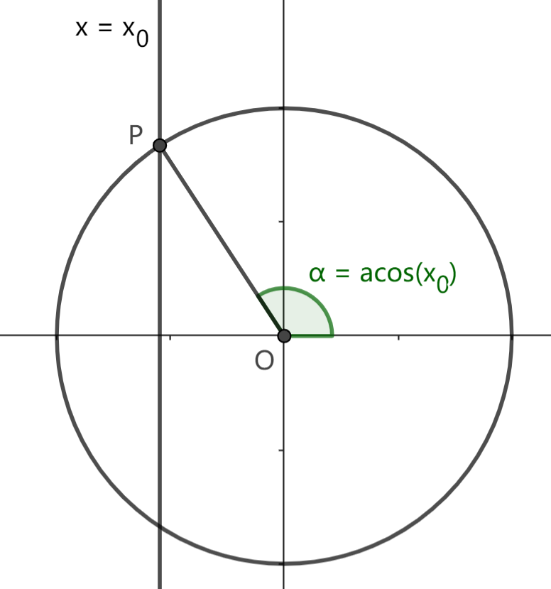
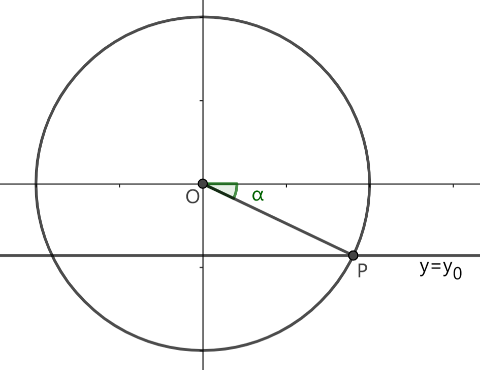
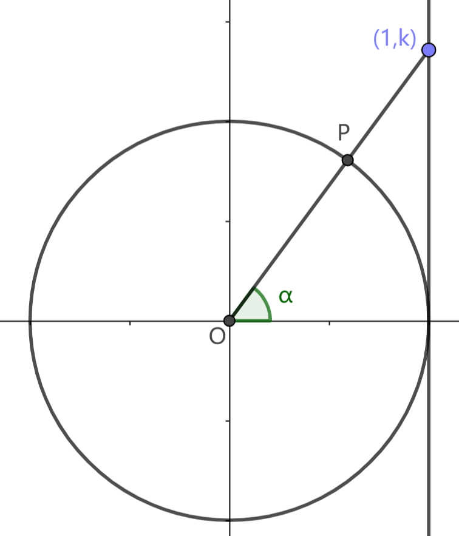
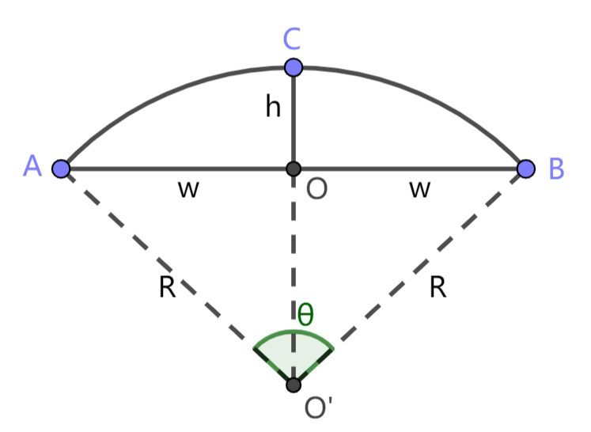

# 1.4 反三角函数与角度求解

前两节我们介绍了三角函数。运用三角函数，我们可以由角度推导长度和坐标信息。那么我们如何由长度和坐标信息计算角度呢？这就要用到反三角函数。

反三角函数可以看作三角函数的逆运算。三角函数有 $\sin,\cos,\tan$，对应地有反三角函数 $\rm asin,acos,atan$。它们由给定的三角函数值计算对应的角度。例如对 $\sin(30\degree)=0.5$，有 $\text{asin}(0.5)=30\degree$。

## 1.4.1 图解反三角函数

要计算 $\text{acos}(x_0)$，就是要找到一个角度 $\theta$，使得 $\cos(\theta)=x_0$。作直线 $x=x_0$，直线与单位圆交点的方位角 $\theta_P$ 满足 $\cos(\theta_P)=x_0$。但是，直线与单位圆最多可以有两个交点，并且每个交点又可以对应无穷多个角度 (相差 $360\degree$ 的整数倍)，我们取哪一个角度作为结果呢？

我们规定，$\text{acos}$ 的结果应当满足 $0\degree\le\text{acos}(x)\le 180\degree$。

类似地，要计算 $\text{asin}(y_0)$，作直线 $y=y_0$，与单位圆交点的方位角 $\theta$ 满足 $\sin(\theta)=y_0$。规定取 $-90\degree\le\theta\le 90\degree$ 的角度作为 $\text{asin}$ 的结果。

对 $\text{atan}(k)$，点 $(1,k)$ 的方位角 $\theta$ 满足 $\tan(\theta)=k$。规定取 $-90\degree<\theta<90\degree$ 的角度作为 $\text{atan}$ 的结果。

## 1.4.2 反三角函数的值域问题

我们现在讨论角度求解中的一个基本问题：已知平面上一点的坐标 $(x,y)$，求该点的方位角。

由于任意角的特性，仅由坐标无法完全确定方位角的值，求得的各个可能值之间将相差 $360\degree$ 的整数倍。所以我们说，如果对平面上所有的点，求得的方位角能够覆盖连续的 $360\degree$ 范围，比如 $0\degree \le \theta \lt 360\degree,\ -180\degree \lt \theta \le 180\degree$，就可以满足一般应用需求。

但是，反三角函数 $\text{acos, asin, atan}$ 都只能覆盖 $180\degree$ 的范围。这就导致直接使用反三角函数求解角度难以满足我们的需要。比如求点 $(x,y)$ 的方位角，如果该点在第三象限，即 $x<0,y<0$，那么 $\text{acos, asin, atan}$ 都无法得到正确的角度。这就是反三角函数固有的值域问题。

一般的处理方法是分类讨论点所在的象限，预先确定角度范围，再通过反三角函数求解方位角。具体实现留给读者思考。

为方便表述，我们引入 `LuaSTG` 的 `Angle` 函数。用 $\text{Angle}(x_1,y_1,x_2,y_2)$ 表示点 $(x_2,y_2)$ 对 $(x_1,y_1)$ 的方位角；$\text{Angle}(A,B)$ 表示 $B$ 对 $A$ 的方位角，即 $\theta_{AB}$；另外规定 $\text{Angle}(x,y)$ 为点 $(x,y)$ 对原点的方位角，即 $\text{Angle}(x,y)=\text{Angle}(0,0,x,y)$。

$\text{Angle}$ 的值域为 $-180\degree \lt \theta \le 180\degree$。

## 习题

1. 测试 `LuaSTG` 中 `Angle(0,0,0,0)` 的结果。

2. 试用 $\text{atan}$ 实现 $\text{Angle}$ 函数 (提示：分类讨论点所在象限)。

3. 如下图，$ACB$ 是一段圆弧。已知 $OC$ 与 $AB$ 垂直，$|OA|=|OB|=w,\ |OC|=h$。求圆弧 $ACB$ 的半径 $R$ 和圆心角 $\theta$。

    
