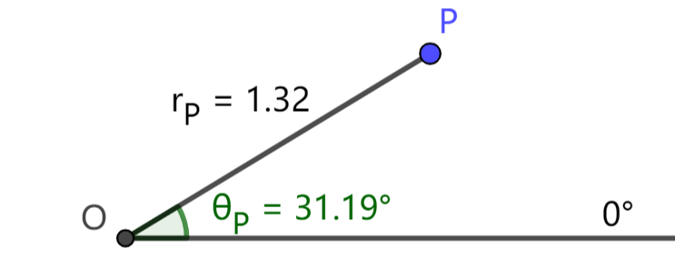
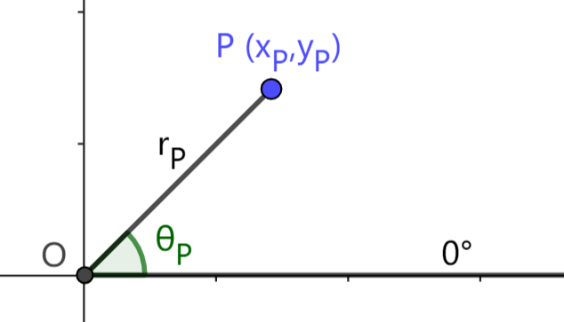
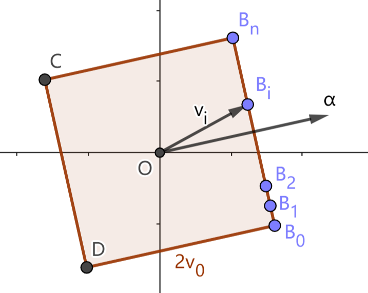

# 1.5 极坐标系

极坐标系是一种描述平面上点的位置的坐标系，与平面直角坐标系一样是较为常用的坐标系。极坐标系由相对原点的距离和方位来确定位置。

## 1.5.1 极坐标
 
如下图，极坐标系由一个极点和一条极轴组成。在平面上取一个定点 $O$，称为 **极点**；以 $O$ 为端点作一条射线表示 $0\degree$ 角，称为 **极轴**。

对平面上任一不与极点重合的点 $P$，将极点到点 $p$ 的距离 $|OP|$ 称为点 $P$ 的 **极径**，记为 $r_P$；将始边为极轴，终边为 $OP$ 的角称为点 $P$ 的 **极角**，记为 $\theta_P$。由 $r_P,\theta_P$ 可以确定点 $P$ 的位置。将有序数对 $(r_P,\theta_P)$ 称为点 $P$ 的 **极坐标**。相对地，点 $P$ 在平面直角坐标系下的坐标称为直角坐标。为了区分直角坐标和极坐标，本教程将极坐标记作 $\langle r_P,\theta_P \rangle$。例如上图点 $P$ 的极坐标为 $\langle 1.32, 31.19\degree \rangle$。

规定极点 $O$ 的极坐标为 $\langle 0,\theta \rangle$，$\theta$ 为任意数值。

由于任意角的性质，一个位置可以有无穷多种极坐标表示，这与直角坐标不同。比如对于任意的 $r,\theta$，极坐标 $\langle r,\theta \rangle, \langle r,\theta+360\degree \rangle, \langle -r,\theta+180\degree \rangle$ 表示同一个位置。我们可以对极径和极角的取值加以限制，从而减少该特性带来的麻烦。比如通常会有 $r\ge0$ 的限制；如果限制 $r \ge 0,\ -180\degree \lt \theta \le 180\degree$，那么除极点之外的每个点都有唯一的极坐标。

## 1.5.2 极坐标与直角坐标的转换

运用前几节介绍的知识，容易得到极坐标与直角坐标的转换方法。

如下图，在平面直角坐标系中，以原点 $O$ 为极点，$x$ 轴非负半轴为极轴，建立极坐标系。

> 对平面上不与原点 (极点) 重合的任一点 $P$，设它的直角坐标为 $(x_p,y_p)$，极坐标为 $\langle r_p,\theta_p \rangle$，则有
> $$
x_p = r_p \cos(\theta_p) \\
y_p = r_p \sin(\theta_p) \\
> $$

> 若已知 $(x_p,y_p)$，则 $\langle r_p,\theta_p \rangle$ 的一个可能值为
> $$
r_p = \text{Dist}(x_p,y_p) \\
\theta_p = \text{Angle}(x_p,y_p) \\
> $$

## 习题

1. 已知平面上一点 $P\langle r,\theta \rangle$，求点 $P$ 经过下述变换后的极坐标 (写出一个可能值即可)：
   1. 绕原点 **顺时针** 旋转 $20\degree$；
   2. 关于 $x$ 轴的轴对称变换；
   3. 关于 $y$ 轴的轴对称变换；
   4. 以原点为中心，等比例均匀放大至 $1.5$ 倍。

2. 试利用极坐标和三角函数的和差角公式证明平面旋转公式：将点 $P(x,y)$ 绕原点逆时针旋转 $\phi$ 角，得到点 $P'(x',y')$，则有

$$
x' = x \cos(\phi) - y \sin(\phi) \\
y' = x \sin(\phi) + y \cos(\phi) \\
$$

3. 如下图，正方形 $B_0B_nCD$ 的中心为原点，边长为 $2v_0$，倾角为 $\alpha$，$B_0,B_1,...,B_i,...,B_n$ 为一组等间距的点。
   1. 若 $\alpha=0\degree$，求点 $B_i\ (i=0,1,2,...,n)$ 的直角坐标 $(v_{xi},v_{yi})$；
   2. 若 $\alpha\neq0\degree$，求点 $B_i\ (i=0,1,2,...,n)$ 的极坐标 $\langle v_i,\theta_i \rangle$。

    