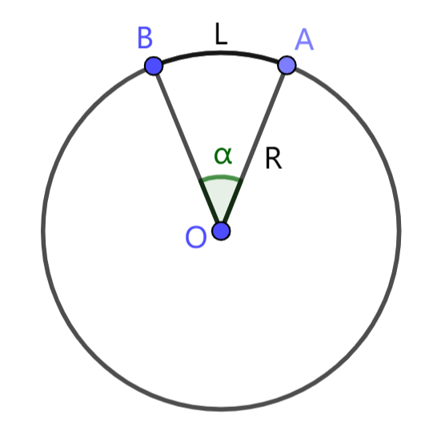

# 1.6 弧度制

在 `LuaSTG` 中，我们使用角度制衡量角的大小。角度制将周角等分为 $360$ 份，每一份的大小定义为 $1\degree$。角度制由于其发展早、容易理解、便于测量计算而得到广泛使用。然而在弧长相关的公式中，角度制将显得烦琐。所以我们引入另一种度量角的体系：弧度制。

## 1.6.1 弧度制的定义

弧度制从对弧长的研究中诞生。如图，圆 $O$ 的半径为 $R$，圆心角 $\alpha$ 对应弧 $AB$，弧长为 $L$。在角度制下，弧长与半径有关系 $L=\dfrac{\pi}{180\degree}\alpha R$，即

$$
\dfrac LR=\dfrac{\pi}{180\degree}\alpha
$$

弧度制直接将角 $\alpha$ 的大小定义为 $\dfrac LR$，称为 $\alpha$ 的弧度值。于是在弧度制下，弧长公式可以简单地表示为 $L = \alpha R$。这种简化是我们使用弧度制的重要原因。

举两个例子。周角 $360\degree$ 对应的圆弧为整个圆周，而我们知道圆的周长 $L$ 与半径 $R$ 满足 $L = 2\pi R$，所以周角的弧度值为 $2\pi$；直角 $90\degree$ 对应 $\dfrac 14$ 圆周，弧长 $L=\dfrac{2\pi R}{4}=\dfrac{\pi}{2}R$，所以直角的弧度值为 $\dfrac{\pi}{2}$。

角度制的单位 度 $(\degree)$ 是不能省略的，但弧度制可以省略单位。不过有时为了强调它表示一个角的大小，可以附上单位 $rad$。比如 $1$ 和 $1\ rad$ 都可以表示弧度值为 $1$ 的角 (相当于大约 $57.3\degree$)。

## 1.6.2 弧度制与角度制的转换

周角的角度值为 $360\degree$，而弧度值为 $2\pi$，我们说 $360\degree = 2\pi$。其他角度的转换都可以由该式得到。

比如要把 $30\degree$ 转换为弧度值，那么有 $30\degree = 30\degree \cdot \dfrac{2\pi}{360\degree} = \dfrac{\pi}{6}$。

`lua` 提供了角度值与弧度值的转换函数。`math.deg(x)` 将弧度 $x\ rad$ 转换为对应角度，`math.rad(x)` 将角度 $x\degree$ 转换为对应弧度。