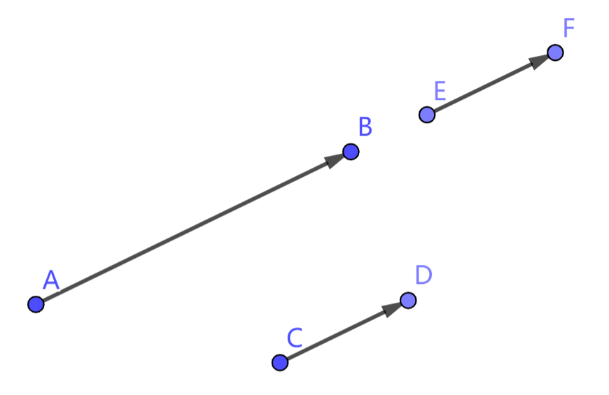

# 2.1 向量：可运算的“点”

我们经常用抽象的数量来描述实际事物的特征，比如长度、温度、价格等。数量的加减乘除等运算可以描述实际事物的各类变化。我们发现，有一些事物由单独一个数是无法描述的：平面上点的位置需要横纵坐标两个数描述，弹幕的速度需要大小和方向两个数描述。对于这类需要多个数来描述的事物，我们引入向量的概念。这一章我们将探究向量的概念、运算、性质等。

这一节介绍向量的基本概念。要更好地理解向量的概念，需要兼顾向量的代数意义和几何意义。

## 2.1.1 代数意义

在代数上，向量可以看作由若干个数构成的有序数组，我们用有序数组 $(a_1,a_2,...,a_n)$ 表示一个向量，其中 $n$ 称为该向量的 **维数**，$a_1,a_2,...,a_n$ 称为该向量在各自维度上的 **分量**。本教程主要研究 $n=2$ 的情况，形如 $(x,y)$。这类向量称为 **二维向量** 或 **平面向量**。在不特殊说明的情况下，教程所说 **向量** 都指 **平面向量**。

我们经常用英文字母以及希腊字母等来指代一个数量，比如 $x,y,\theta$，向量也可以用英文字母和希腊字母来指代，为了区分数量和向量，我们在指代向量的字母上方写上一个箭头，如 $\vec r = (3,4)$ 表示一个向量 $\vec r$，它的值为 $(3,4)$。

## 2.1.2 几何意义

在几何上，向量可以看作平移量的抽象。对一个向右平移 $\Delta x$，向上平移 $\Delta y$ 的平移变换，我们可以用向量 $(\Delta x,\Delta y)$ 表示。同时，由于点的坐标可以视为从原点到该点的平移量，向量也可以看作是点的抽象。我们用直角坐标 $(x,y)$ 和极坐标 $\langle r,\theta \rangle$ 描述点的位置，也可以用同样的方法来表示向量的值。

平面上一点 $A$ 对应的向量可以记作 $\overrightharpoon A$，从点 $A$ 到点 $B$ 的平移量可以记作 $\overrightharpoon{AB}$。自然地，对平面上任一点 $P$，有 $\overrightharpoon{P}=\overrightharpoon{OP}$。

## 2.1.3 向量的大小和方向

将向量 $\vec r=(x,y)$ 视为平面上一点，该点与原点的距离称为向量 $\vec r$ 的 **长度** 或 **大小**，记为 $|\vec r|$。不产生歧义时，也可直接记作 $r$。该点的方位角称为向量 $\vec r$ 的方向，记为 $\langle \vec r \rangle$。

大小为 $1$ 的向量称为 **单位向量**。

大小为 $0$ 的向量称为 **零向量**，记为 $\vec 0$。规定零向量的方向为任意角度。

对两个非零向量 $\vec r_1, \vec r_2$，设它们在平面上对应点 $A,B$。将始边为 $OA$，终边为 $OB$ 的任意角称为 $\vec r_1, \vec r_2$ 的夹角，记作 $\langle \vec r_1, \vec r_2 \rangle$。我们发现，$\langle \vec r_1, \vec r_2 \rangle\equiv\langle\vec r_2\rangle-\langle\vec r_1\rangle$。

## 2.1.4 向量的相等和取反

对向量 $\vec r_1=(x_1,y_1),\ \vec r_2=(x_2,y_2)$，如果两向量的各分量对应相等，即 $x_1=x_2,\ y_1=y_2$，则称两向量是 **相等** 的，记作 $\vec r_1=\vec r_2$。如果各分量对应互为相反数，即 $x_1=-x_2,\ y_1=-y_2$，则称两向量互为 **相反向量**，记作 $\vec r_1=-\vec r_2$。

对两个向量 $\vec r_1,\vec r_2$，若它们大小相等、方向相同，那么两向量相等；若它们大小相等、方向相反，那么两向量互为相反向量。

## 2.1.5 向量的平行 (共线) 与垂直

对两个非零向量 $\vec r_1,\vec r_2$，如果二者方向相同或相反，就称两向量互相 **平行**，记作 $\vec r_1 \parallel \vec r_2$。如果两向量方向互相垂直，就称两向量互相 **垂直**，记作 $\vec r_1 \perp\vec r_2$。

<!-- perpendicular -->

我们规定，零向量与任意向量平行，也与任意向量垂直。即对任意向量 $\vec r$，有

$$ \vec0 \parallel \vec r,\quad \vec0 \perp \vec r $$

如下图，$AB$ 与 $EF$ 共线，$CD$ 与 $EF$ 平行且长度相等。根据向量平行的定义，有 $\overrightharpoon{AB}\parallel\overrightharpoon{CD},\ \overrightharpoon{AB}\parallel\overrightharpoon{EF}$。由于向量不关注起点和终点，只关注长度和方向，向量 $\overrightharpoon{CD}$ 和 $\overrightharpoon{EF}$ 是完全相同的。这就是说，对向量而言，平行与共线没有任何区别，我们把 **向量平行** 也叫做 **向量共线**。

