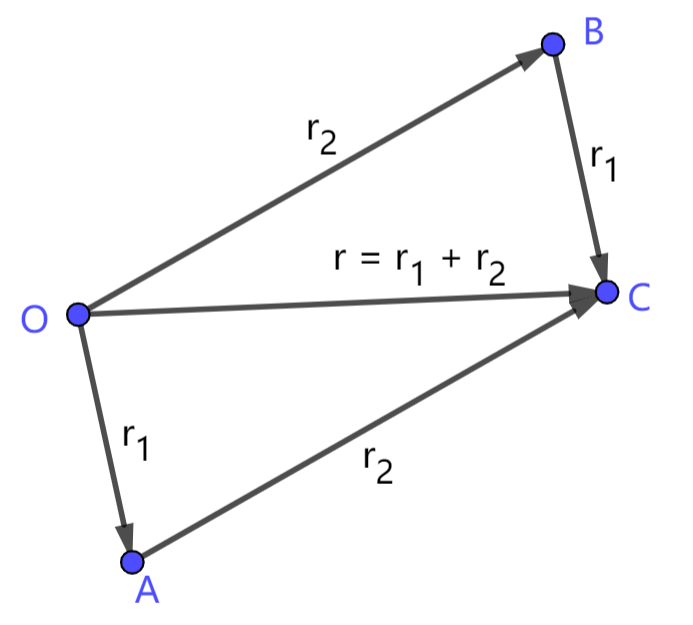
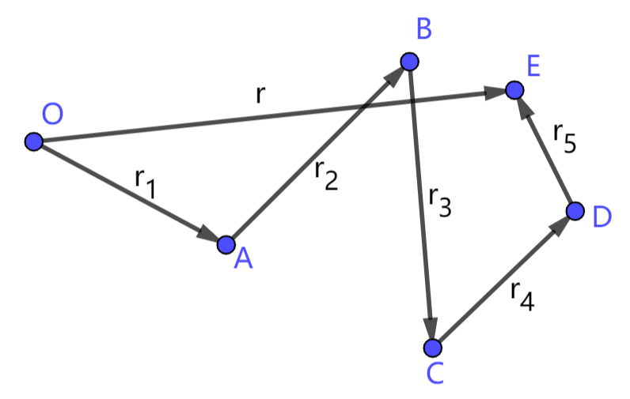
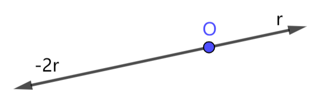
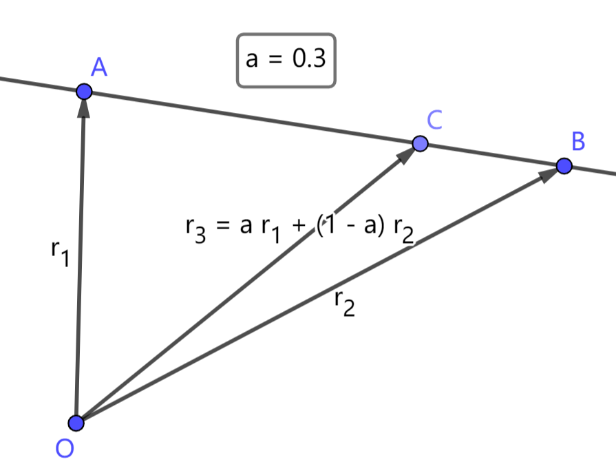

# 2.2 向量的线性运算

这一节我们讨论向量的线性运算，包括向量的加减运算和数乘运算。我们介绍向量最终是要把向量应用到几何问题中，所以不仅要关注向量的运算方法，也要关注向量运算的几何含义。

## 2.2.1 向量加法

> 设向量 $\vec r_1=(x_1,y_1),\ \vec r_2=(x_2,y_2)$。$\vec r_1,\vec r_2$ 的和是一个向量，记作 $\vec r_1+\vec r_2$，该向量的各分量是 $\vec r_1,\vec r_2$ 对应分量的和，即
> $$
\vec r_1 + \vec r_2 = (x_1+x_2,\ y_1+y_2)
> $$

向量的加法与数的加法具有基本相同的性质：
1. 交换律：对任意两个向量 $\vec r_1,\vec r_2$，有 $\vec r_1+\vec r_2 = \vec r_2+\vec r_1$；
2. 结合律：对任意三个向量 $\vec r_1,\vec r_2,\vec r_3$，有 $\vec r_1+(\vec r_2+\vec r_3) = (\vec r_1+\vec r_2)+\vec r_3$；
3. 零向量与任意向量相加等于该向量：$\vec0+\vec r=\vec r$；
4. 相反向量的和为零向量：$\vec r+(-\vec r)=\vec0$。

如下图，对向量 $\vec r_1,\vec r_2$，在平面上取点 $A$ 使得 $\overrightharpoon{OA}=\vec r_1$，取点 $C$ 使得 $\overrightharpoon{AC}=\vec r_2$，则有 $\overrightharpoon{OC}=\overrightharpoon{OA}+\overrightharpoon{AC}=\vec r_1+\vec r_2$。这种求和方法称为向量加法的 **三角形法则**。

我们也可以作平行四边形 $OACB$，使得 $\overrightharpoon{OA}=\vec r_1,\ \overrightharpoon{OB}=\vec r_2$，此时对角线 $\overrightharpoon{OC}=\vec r_1+\vec r_2$。这种求和方法称为向量加法的 **平行四边形法则**。

我们可以用三角形法则完成多个向量的加法。比如对下图的向量 $\vec r_1,\cdots,\vec r_5$，将它们首尾相连，起点为 $O$，终点为 $E$，$\overrightharpoon{OE}=\vec r$，则 $\vec r=\vec r_1+\cdots+\vec r_5$。

## 2.2.2 向量减法

> 设向量 $\vec r_1=(x_1,y_1),\ \vec r_2=(x_2,y_2)$。$\vec r_1,\vec r_2$ 的差是一个向量，记作 $\vec r_1-\vec r_2$，该向量的各分量是 $\vec r_1,\vec r_2$ 对应分量的差值，即
> $$
\vec r_1 - \vec r_2 = (x_1-x_2,\ y_1-y_2)
> $$

向量的减法与数的减法也具有基本相同的性质，这里不作赘述。

向量减法是向量加法的逆运算，其几何含义可以参考向量加法的几何含义。值得注意的是，对平面上任意两点 $A,B$，根据向量加法有 $\overrightharpoon{OA}+\overrightharpoon{AB}=\overrightharpoon{OB}$，移项得 $\overrightharpoon{AB}=\overrightharpoon{OB}-\overrightharpoon{OA}$，即
$$\overrightharpoon{AB}=\overrightharpoon{B}-\overrightharpoon{A}$$

利用该式可以将点与平移量相互转换。

## 2.2.3 向量数乘

> 数乘是向量与数的运算。设向量 $\vec r=(x,y)$，数 $a$ 与向量 $\vec r$ 的数乘记作 $a\cdot\vec r$ 或 $\vec r \cdot a$，"$\cdot$" 号可省略。数乘的结果是一个向量，其各分量为 $\vec r$ 的各分量乘以 $a$，即
> $$
a\cdot\vec r = (ax,ay)
> $$

数乘运算的性质与数的乘法相似：
1. 交换律：$a\cdot\vec r=\vec r\cdot a$
2. 结合律：$a\cdot(b\cdot\vec r)=(ab)\cdot\vec r=b\cdot(a\cdot\vec r)$
3. 对加法的分配律：
   1. $(a+b)\cdot\vec r=a\cdot\vec r+b\cdot\vec r$
   2. $a\cdot(\vec r_1+\vec r_2)=a\cdot\vec r_1+a\cdot\vec r_2$
4. 消去律：
   1. 若 $a\cdot\vec r=b\cdot\vec r$，且 $\vec r\neq\vec0$，则 $a=b$
   2. 若 $a\cdot\vec r_1=a\cdot\vec r_2$，且 $a\neq0$，则 $\vec r_1=\vec r_2$

对向量 $\vec r$ 和数 $a$，若 $a=0$ 或 $\vec r=\vec0$，则数乘结果为零向量。当 $a\neq0,\ \vec r\neq\vec0$ 时，向量 $a\cdot\vec r$ 的大小是 $\vec r$ 的 $|a|$ 倍，即 $|a\cdot\vec r|=|a|\cdot|\vec r|$。向量 $a\cdot\vec r$ 与 $\vec r$ 共线，当 $a>0$ 时，$a\cdot\vec r$ 与 $\vec r$ 方向相同；$a<0$ 时，$a\cdot\vec r$ 与 $\vec r$ 方向相反。

数乘运算与向量平行有紧密的联系。
> 对非零向量 $\vec r_1,\vec r_2$，
> $$ \vec r_1 \parallel \vec r_2 $$
> 等价于存在 $a\neq0$，使得
> $$ \vec r_1 = a\cdot \vec r_2 $$

## 2.2.4 三点共线问题

从数乘与向量平行的关系可以延伸到三点共线问题。三点共线问题描述如下：

> 设平面上有两两不重合的三点 $A,B,C$，则 $A,B,C$ 三点共线等价于存在 $a,b\ (a+b=1)$，使得
> $$ \overrightharpoon{C}=a\overrightharpoon{A}+b\overrightharpoon{B} $$

该定理大致证明过程如下：

$1)$ 如果 $A,B,C$ 三点共线，那么向量 $\overrightharpoon{AB},\ \overrightharpoon{AC}$ 共线。于是存在 $\lambda$，使得 $\overrightharpoon{AC}=\lambda\overrightharpoon{AB}$。代入 $\overrightharpoon{AC}=\overrightharpoon{C}-\overrightharpoon{A},\ \overrightharpoon{AB}=\overrightharpoon{B}-\overrightharpoon{A}$，得
$$ \overrightharpoon{C}=(1-\lambda)\overrightharpoon{A}+\lambda\overrightharpoon{B} $$
令 $a=1-\lambda,\ b=\lambda$，即得 $a+b=1,\ a\overrightharpoon{A}+b\overrightharpoon{B}=\overrightharpoon{C}$。

$2)$ 如果存在 $a+b=1$ 使得 $\overrightharpoon{C}=a\overrightharpoon{A}+b\overrightharpoon{B}$，可得 
$$ \overrightharpoon{AC}=b\overrightharpoon{AB} $$
所以 $\overrightharpoon{AC}$ 与 $\overrightharpoon{AB}$ 共线，$A,B,C$ 三点共线。

由该定理，我们可以得到一种构造直线上点的方法：

> 已知直线上两点 $A,B$，任取数 $a$，点 $\overrightharpoon{C}=a\overrightharpoon{A}+(1-a)\overrightharpoon{B}$ 一定在直线 $AB$ 上。并且如果 $0\le a\le 1$，则点 $a\overrightharpoon{A}+(1-a)\overrightharpoon{B}$ 在线段 $AB$ 上。

## 习题

1. 举例说明：$|\vec r_1|+|\vec r_2|$ 与 $|\vec r_1+\vec r_2|$ 不一定相等。试说明满足什么条件时，有 $|\vec r_1|+|\vec r_2|=|\vec r_1+\vec r_2|$ ？

2. 已知平面上不重合的两点 $\overrightharpoon{A}=\vec r_1=(x_1,y_1),\ \overrightharpoon{B}=\vec r_2=(x_2,y_2)$，求线段 $AB$ 的两个三等分点的坐标。

3. 对平面上任意三个点 $A,B,C$，试证明：$A,B,C$ 三点共线等价于存在不全为 $0$ 的数 $a,b,c$，使得
$$
a+b+c=0 \\
a\overrightharpoon{A}+b\overrightharpoon{B}+c\overrightharpoon{C}=\vec 0
$$