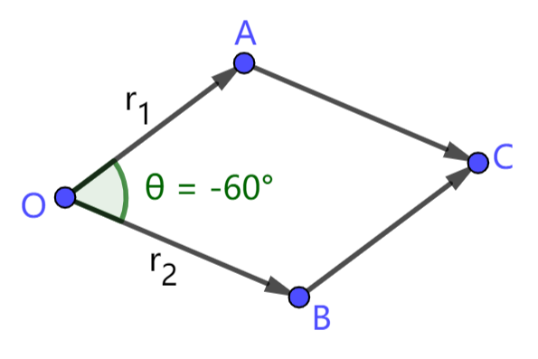
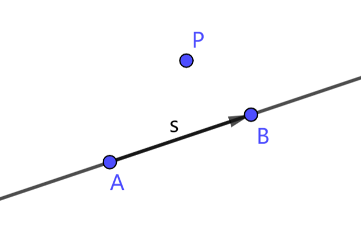
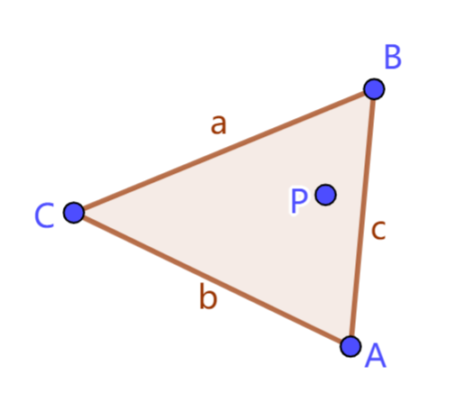
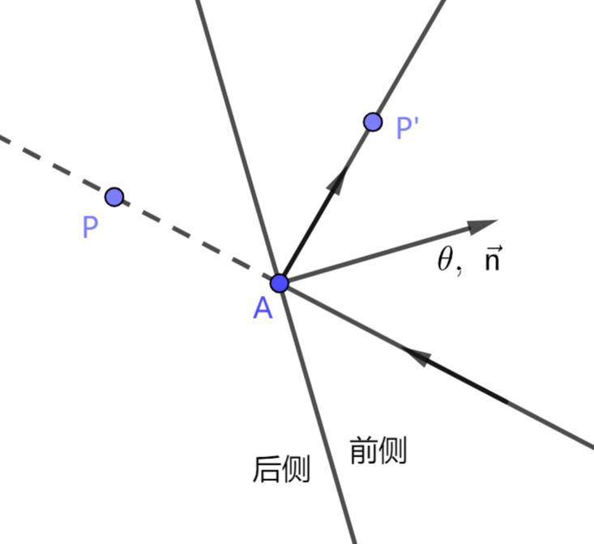

# 2.3 向量的乘积

在长久的探索实践中，人们定义了多种向量乘积。这节主要介绍其中几何意义较明确的两种：内积和外积。

## 2.3.1 逐元素乘积

> 设两个向量 $\vec r_1=(x_1,y_1), \ \vec r_2=(x_2,y_2)$。二者的逐元素乘积是一个向量，记作 $\vec r_1*\vec r_2$。该向量的各分量是 $\vec r_1,\vec r_2$ 对应分量的乘积，即
> $$
\vec r_1 * \vec r_2 = (x_1x_2, \ y_1y_2)
> $$
> 式中 "$*$" 号不能省略。

逐元素乘积是数量的乘积在向量上的直接延拓，这使得它与数量乘法有十分相似的性质。
1. 交换律：$\vec r_1*\vec r_2 = \vec r_2*\vec r_1$
2. 结合律：$\vec r_1*(\vec r_2*\vec r_3) = (\vec r_1*\vec r_2)*\vec r_3$
3. 分配律：$(\vec r_1+\vec r_2)*\vec r_3=\vec r_1*\vec r_3+\vec r_2*\vec r_3$
4. 消去律：若 $\vec r_1*\vec r_3=\vec r_2*\vec r_3$，且 $\vec r_3$ 各分量都不为零，则 $\vec r_1=\vec r_2$

逐元素乘积容易理解，但它的几何意义较小，所以它不是我们介绍的重点。

## 2.3.2 内积 (点乘)

> 两个向量的 **内积** 是一个数。设两个向量 $\vec r_1=(x_1,y_1), \ \vec r_2=(x_2,y_2)$，$\vec r_1$ 与 $\vec r_2$ 的内积记作 $\vec r_1\cdot\vec r_2$，乘号 "$\cdot$" **不能省略**。内积的结果为
> $$
\vec r_1\cdot\vec r_2=x_1x_2+y_1y_2
> $$

向量的内积具有以下性质：
1. 交换律：$\vec r_1\cdot\vec r_2=\vec r_2\cdot\vec r_1$
2. 结合律不成立：$\vec r_1\cdot(\vec r_2\cdot\vec r_3)\neq(\vec r_1\cdot\vec r_2)\cdot\vec r_3$ (左式向量与 $\vec r_1$ 共线，右式向量与 $\vec r_3$ 共线，容易构造反例使得左右两式不共线，此时左右两式一定不相等)
3. 正定性：$\vec r\cdot\vec r=|\vec r|^2\ge 0$，当且仅当 $\vec r=\vec 0$ 时有 $\vec r\cdot\vec r=0$
4. 线性性：$(a\cdot\vec r_1)\cdot\vec r_2=a\cdot(\vec r_1\cdot\vec r_2) \quad (\vec r_1+\vec r_2)\cdot\vec r_3=\vec r_1\cdot\vec r_3+\vec r_2\cdot\vec r_3$

线性性也可表述为：
$$
(a\cdot\vec r_1+b\cdot\vec r_2)\cdot\vec r_3
=
a(\vec r_1\cdot\vec r_3)+b(\vec r_2\cdot\vec r_3)
$$

内积看起来就是把逐元素乘积的各分量相加，但它确实有良好的几何意义。

> 对平面上的两个向量 $\vec r_1,\vec r_2$，设夹角 $\langle\vec r_1,\vec r_2\rangle=\theta$。则内积
> $$
\vec r_1\cdot\vec r_2=|\vec r_1|\cdot|\vec r_2|\cos(\theta)
> $$

证明：设 $\vec r_1=(x_1,y_1)=\langle r_1,\theta_1\rangle,\ \vec r_2=(x_2,y_2)=\langle r_2,\theta_2\rangle$，则
$$
\begin{array}{rl}
\vec r_1\cdot\vec r_2 &= x_1x_2+y_1y_2 \\
&= r_1\cos(\theta_1)\cdot r_2\cos(\theta_2)
+ r_1\sin(\theta_1)\cdot r_2\sin(\theta_2) \\
&= r_1r_2(\cos(\theta_1)\cos(\theta_2)+\sin(\theta_1)\sin(\theta_2)) \\
&= r_1r_2\cos(\theta_2-\theta_1) \\
&= r_1r_2\cos(\theta)\quad
(注:\langle\vec r_2\rangle-\langle\vec r_1\rangle
\equiv\langle\vec r_1,\vec r_2\rangle)
\end{array}
$$

根据内积的几何意义，我们可以用内积判断向量是否垂直。

> 对向量 $\vec r_1,\vec r_2$，$\vec r_1\perp\vec r_2$ 等价于 $\vec r_1\cdot\vec r_2=0$。

若 $\vec r_1,\vec r_2$ 垂直，则两向量夹角与 $90\degree$ 或 $-90\degree$ 同余，余弦值总为 $0$，所以向量内积为 $0$。

## 2.3.3 外积 (叉乘)

> 两个向量的 **外积** 同样是一个数。设两个向量 $\vec r_1=(x_1,y_1), \ \vec r_2=(x_2,y_2)$，$\vec r_1$ 与 $\vec r_2$ 的外积记作 $\vec r_1\times\vec r_2$，乘号 "$\times$" **不能省略**。外积的结果为
> $$
\vec r_1\times\vec r_2=x_1y_2-x_2y_1
> $$

外积主要有以下性质：
1. 反交换律：$\vec r_1\times\vec r_2 = -\vec r_2\times\vec r_1$
2. 线性性：$(a\cdot\vec r_1+b\cdot\vec r_2)\times\vec r_3
= a(\vec r_1\times\vec r_3)+b(\vec r_2\times\vec r_3)$
3. 对任意 $\vec r$，$\vec r\times\vec r=0$

外积的几何意义同样与夹角有关。仿照内积的方法可以证明：

> 对平面上的两个向量 $\vec r_1,\vec r_2$，设夹角 $\langle\vec r_1,\vec r_2\rangle=\theta$。则外积
> $$
\vec r_1\times\vec r_2=|\vec r_1|\cdot|\vec r_2|\sin(\theta)
> $$

如下图，在平行四边形 $OACB$ 中，$\overrightharpoon{OA}=\vec r_1,\ \overrightharpoon{OB}=\vec r_2,\ \langle\vec r_1,\vec r_2\rangle=\theta$。根据平行四边形的面积公式，$OACB$ 的面积与 $\vec r_1,\vec r_2$ 外积的绝对值相等。

外积可以用于判定向量平行。

> 对向量 $\vec r_1,\vec r_2$，$\vec r_1\parallel\vec r_2$ 等价于 $\vec r_1\times\vec r_2=0$。

外积还可以用于求解点到直线的距离。在上图中，考虑点 $A$ 到直线 $OB$ 的距离，设为 $h$。平行四边形的面积 $S=h\cdot|OB|=|\overrightharpoon{OA}\times\overrightharpoon{OB}|$，于是有
$$
h=\dfrac{|\overrightharpoon{OA}\times\overrightharpoon{OB}|}{|\overrightharpoon{OB}|}
$$

## 习题

1. 设非零向量 $\vec r_1,\vec r_2$ 的长度为定值，方向可变。当 $\vec r_1,\vec r_2$ 具有怎样的方向时，
   1. 内积 $\vec r_1\cdot\vec r_2$ 取得最大值？
   2. 内积 $\vec r_1\cdot\vec r_2$ 取得最小值？
   3. 外积 $\vec r_1\times\vec r_2$ 取得最大值？
   4. 外积 $\vec r_1\times\vec r_2$ 取得最小值？

2. 证明：$|\vec r_1\cdot\vec r_2|^2+|\vec r_1\times\vec r_2|^2 = |\vec r_1|^2 |\vec r_2|^2$。

3. 如下图，已知直线上两点 $A,B$，直线的方向向量 $\overrightharpoon{AB}=\vec s$。对于平面上的任一点 $P$，如何判断 $P$ 位于直线 $AB$ 的哪一侧？
   
   

4. 已知平面上一个三角形的三个顶点 $A,B,C$，对平面上任一点 $P$，满足什么条件时，可以判定点 $P$ 在三角形 $ABC$ 内部？试用外积表示判定条件。(提示：参考问题 3)

   

5. 下图是一个镜面反射模型，已知反射面上一点 $A$，有一个单位向量 $\vec n$ 与反射面垂直，由后侧指向前侧。已知该向量的方向为 $\theta$。
   1. 由点 $A$ 和方向 $\theta$ 能否唯一确定一个反射面？用 $\theta$ 表示 $\vec n$。
   2. 对平面上一点 $P$，满足什么条件时，可以判定点 $P$ 在反射面的后侧？
   3. 若点 $P$ 在反射面的后侧，点 $P,P'$ 关于反射面对称，试求 $|PP'|$ 和 $P'$ 点坐标。

   