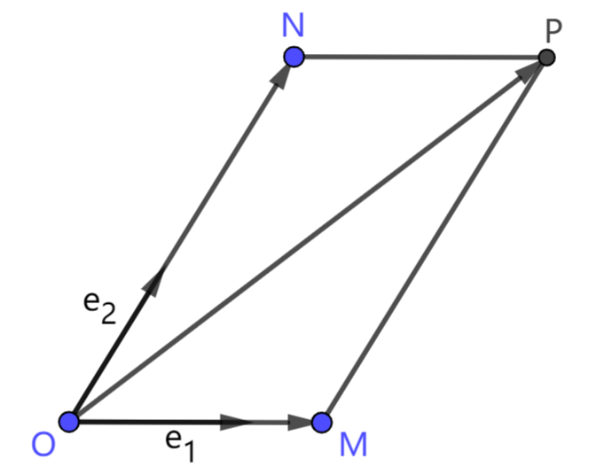

# 2.4 向量基底

## 2.4.1 平面基底与仿射坐标系

首先介绍平面向量基本定理：

> 在平面上，任意给定两个不共线的向量 $\vec e_1,\vec e_2$，对平面上任一向量 $\vec r$，都存在唯一一组 $a,b$，使得
> $$\vec r=a\vec e_1+b\vec e_2$$

我们作图说明该定理。如下图，$\vec e_1,\vec e_2$ 是两个不共线向量。平行四边形 $OMPN$ 中，$\overrightharpoon{OM}\parallel\vec e_1,\ \overrightharpoon{ON}\parallel\vec e_2,\ \overrightharpoon{OP}=\vec r$。由向量共线可知，存在 $a,b$ 使得 $\overrightharpoon{OM}=a\vec e_1,\ \overrightharpoon{ON}=b\vec e_2$，此时有 $\vec r=a\vec e_1+b\vec e_2$。

我们把不共线向量对 $(\vec e_1,\vec e_2)$ 称为平面的一组 **基底**。对向量 $\vec r=a\vec e_1+b\vec e_2$，将有序数对 $(a,b)$ 称为 $\vec r$ 在基底 $(\vec e_1,\vec e_2)$ 下的坐标。由一组基底和一个原点可以建立坐标系，称为 **仿射坐标系**。基底 $(\vec e_1,\vec e_2)$ 和原点 $A$ 确定的仿射坐标系记作 $(A;\vec e_1,\vec e_2)$。对平面上一点 $P$，向量 $\overrightharpoon{AP}$ 在基底 $(\vec e_1,\vec e_2)$ 下的坐标称为点 $P$ 在该坐标系下的 **仿射坐标**。

## 2.4.2 单位正交基

在平面基底中，**单位正交基** 是较为特殊的一种。单位正交基由两个 **互相垂直** 的 **单位向量** 构成。

例如我们默认使用的平面直角坐标系 $xOy$，它对应的基底就是一个单位正交基，记作 $(\^i,\^j)$，其中 $\^i=(1,0)$ 是沿 $x$ 轴正向的单位向量，$\^j=(0,1)$ 是沿 $y$ 轴正向的单位向量。当我们说一个向量 $\vec r$ 的坐标为 $(x,y)$ 时，可以理解为 $\vec r=x\^i+y\^j$。

单位正交基具有较良好的性质 (我们将在习题中简单讨论)，所以我们在实际问题中一般倾向于建立单位正交基。

## 2.4.3 仿射坐标系的坐标转换

仿射坐标系之间的坐标转换，是围绕基底的定义展开的。若已知两个仿射坐标系 $(A_1;\vec m_1,\vec n_1),\ (A_2;\vec m_2,\vec n_2)$，设平面上一点 $P$ 在两个坐标系下的坐标分别为 $(a_1,b_1),\ (a_2,b_2)$，则由仿射坐标的定义有

$$
\begin{array}{rl}
\vec P &= \vec A_1 + a_1 \vec m_1 + b_1 \vec n_1 \\
&= \vec A_2 + a_2 \vec m_2 + b_2 \vec n_2 \\
\end{array}
$$

转换为坐标形式，得方程组

$$
x_{A1} + a_1 \cdot x_{m1} + b_1 \cdot x_{n1}
=
x_{A2} + a_2 \cdot x_{m2} + b_2 \cdot x_{n2}
\\
y_{A1} + a_1 \cdot y_{m1} + b_1 \cdot y_{n1}
=
y_{A2} + a_2 \cdot y_{m2} + b_2 \cdot y_{n2}
$$

这是一个关于 $a_1,b_1,a_2,b_2$ 的线性方程组。坐标转换实质上就是解这个方程组。例如当 $(a_2,b_2)$ 已知时，该方程组是关于 $a_1,b_1$ 的二元一次方程组，解法参照二元一次方程组解法，不做赘述。

## 习题

1. 已知单位正交基 $(\vec e_1,\vec e_2)$ 和向量 $\vec r$，用向量运算表示 $\vec r$ 在该基底下的坐标。(提示：向量运算的几何意义)

2. 试利用向量基底推导旋转公式：将点 $P(x,y)$ 绕原点逆时针旋转 $\phi$ 角，得到点 $P'(x',y')$，则有

$$
x' = x \cos(\phi) - y \sin(\phi) \\
y' = x \sin(\phi) + y \cos(\phi) \\
$$

3. 在平面上建立仿射坐标系 $(O;\vec e_1,\vec e_2)$ ($\vec e_1,\vec e_2$ 不共线)，对任意向量 $\vec r,\vec r_1,\vec r_2$，设仿射坐标分别为 $(a,b),(a_1,b_1),(a_2,b_2)$。任取实数 $\lambda$。
   1. $\vec e_1,\vec e_2$ 满足什么条件时，$\vec r_1+\vec r_2$ 的仿射坐标为 $(a_1+a_2,b_1+b_2)$ ?
   2. $\vec e_1,\vec e_2$ 满足什么条件时，$\lambda\vec r$ 的仿射坐标为 $(\lambda a,\lambda b)$ ?
   3. $\vec e_1,\vec e_2$ 满足什么条件时，$\vec r_1\cdot\vec r_2 = a_1a_2+b_1b_2$ ?
   4. $\vec e_1,\vec e_2$ 满足什么条件时，$\vec r_1\times\vec r_2 = a_1b_2-a_2b_1$ ?
   > 注：本题中的向量运算在默认坐标系下进行。比如 $\vec r_1\cdot\vec r_2 = x_1x_2+y_1y_2$，其中 $(x_1,y_1),(x_2,y_2)$ 为 $\vec r_1,\vec r_2$ 在默认坐标系的坐标。也就是说，本题的目的是探究仿射坐标系下的向量运算方法与默认运算方法是否一致。