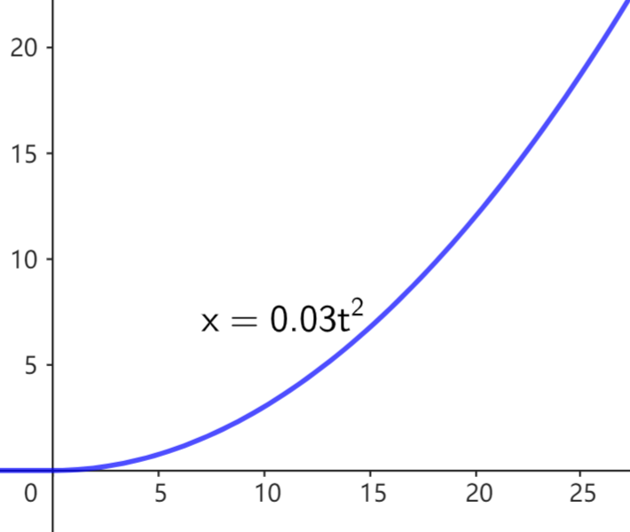
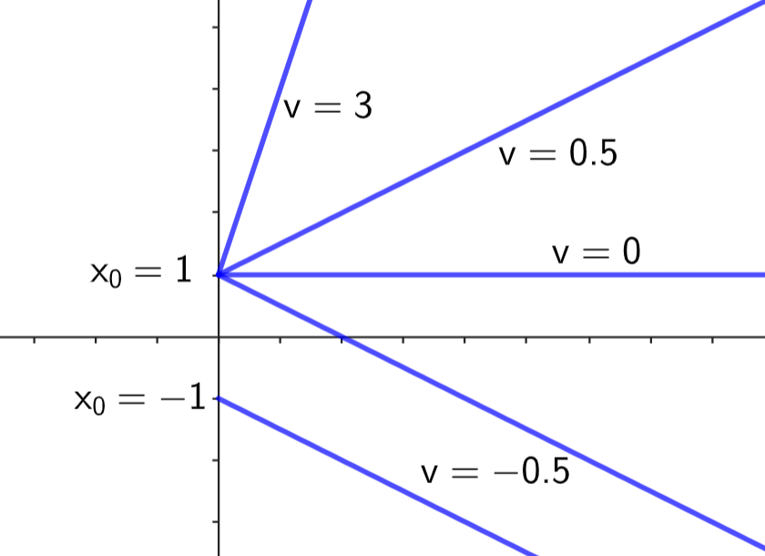
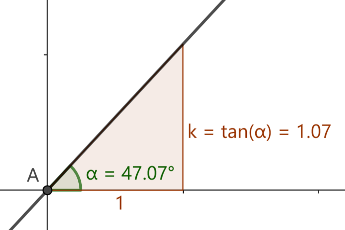
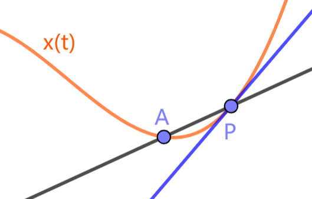
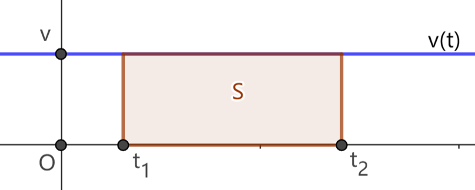
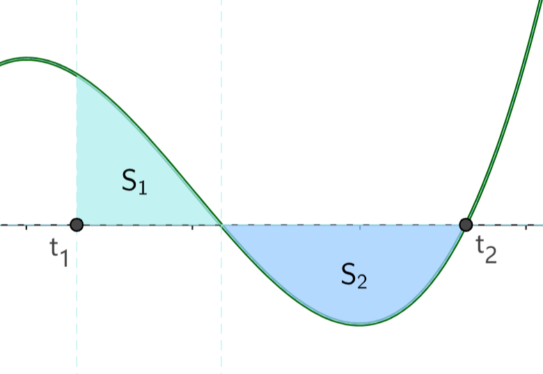
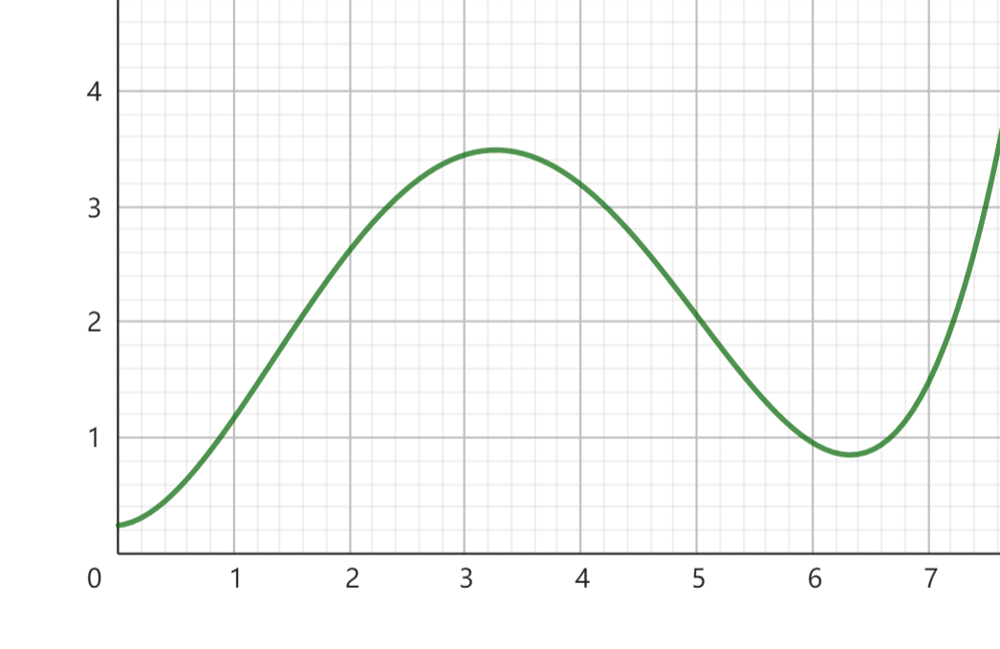
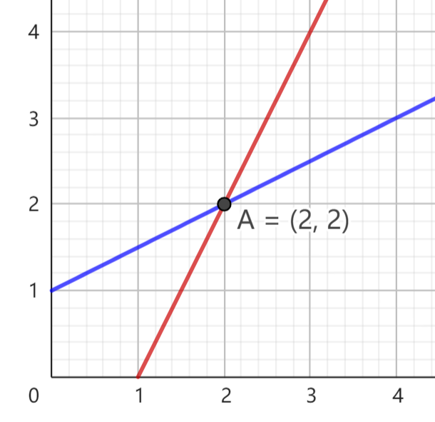

# 3.2 用图象表示运动

我们希望直观展示点的运动情况，常用的方案是画出运动的时间与点的位置的关系图，类似天气预报中日期与温度的统计图。这一节介绍如何画出运动的图象，以及如何从图象中观察点的运动规律。

## 3.2.1 运动的图象

对直线运动 $x(t)$，以时间为横轴，位置为纵轴，建立平面直角坐标系。对运动过程中的每个时间 $t$ 以及对应位置 $x$，将点 $(t,x)$ 绘制在坐标系中，绘制的所有点将组成一条曲线 (不严谨地)，我们将这条曲线称为运动的 **位置-时间图象**，简记为 $x$-$t$ 图象。类似地，我们可以画出运动的 $v$-$t$ 图象、$a$-$t$ 图象等。

下图是运动 $x=0.03t^2$ 的 $x$-$t$ 图象，从图象中我们可以看到运动的大体趋势，也能估计点在某一时间的大致位置。

若已知运动的表达式，可以用 `Desmos`、`GeoGebra` 等网站 / 软件绘制对应图象。

## 3.2.2 由 $x$-$t$ 图象观察速度变化

从 $x$-$t$ 图象中，我们不仅能观察点的位置变化情况，也能观察速度的变化情况。

我们首先研究匀速直线运动。设初始位置 ($t=0$ 时的位置) 为 $x_0$，速度为 $v$，则有 $x(t)=x_0+vt$。$x$-$t$ 图象为一条直线，改变 $x_0,v$，图象会发生改变。

如上图，我们发现，初始位置 $x_0$ 与直线和纵轴的交点有关，速度 $v$ 与直线的倾斜程度有关。

$v$ 与直线的倾斜程度具体有怎样的关系呢？回顾速度的定义，$v$ 是任意时间段的位移 $\Delta x$ 与时间差 $\Delta t$ 的比值。在直线上任取两点，$\Delta t$ 表现为两点横坐标的差值，$\Delta x$ 表现为两点纵坐标的差值。

我们将直线上任意不重合两点的纵坐标差值与横坐标差值的比例称为直线的 **斜率**。当直线与横轴垂直时，横坐标差值总为 $0$，我们称此时直线的斜率 **不存在** 或为 **无穷大**。

衡量直线倾斜程度的指标主要是倾斜角和斜率。可以证明：

> 若直线的倾斜角为 $\alpha\ (-90\degree\lt\alpha\lt90\degree)$，则直线的斜率为 $\tan(\alpha)$。

如下图，对于一般的直线运动图象，考察图象上一点 $P(t_0,x(t_0))$。当有一点 $A$ 沿图象无限趋近 $P$ 时，直线 $AP$ 将无限趋近于一条定直线 (图中蓝色直线)，这条定直线称为曲线 $x(t)$ 在点 $P$ 处的 **切线**。

> 运动在 $t_0$ 处的瞬时速度与图象在点 $P(t_0,x(t_0))$ 处的切线斜率相等。

## 3.2.3 由 $v$-$t$ 图象观察位置变化

首先还是从匀速直线运动入手。下图是一个匀速直线运动的 $v$-$t$ 图象，速度 $v>0$ 恒定，图象是一条水平线。任取 $t_1<t_2$，点在 $t_1<t<t_2$ 的位置变化 $\Delta x=v(t_2-t_1)$，在图象上表现为图示矩形的面积 $S$。

对于一般的 $v$-$t$ 图象，比如下图，考虑 $t_1<t<t_2$ 时间段。运动图象、横轴和 $t_1,t_2$ 对应竖直线围成一块区域。我们说点在 $t_1<t<t_2$ 时间段的位置变化 $\Delta x$ 等于这块区域的有向面积。

所谓有向面积，在横轴上方的区域 (如图中 $S_1$)，有向面积取正值；在横轴下方的区域 (如图中 $S_2$)，有向面积取负值。

假设图中 $S_1,S_2$ 面积都为 $2$，则总共的有向面积为 $2-2=0$，这说明点在 $t_1$ 和 $t_2$ 的位置相同。

## 习题

1. 若下图是一个点做直线运动的 $x$-$t$ 图象，试描述该点的位置和速度的大致变化情况。
2. 若下图是一个点做直线运动的 $v$-$t$ 图象，试描述该点的位置和速度的大致变化情况。

    

3. 下图中蓝色直线和红色直线分别代表两个点的运动情况。
   1. 如果两直线为两点的 $x$-$t$ 图象，在 $A$ 处 ($t=2$) 两点是否一定重合？若不一定重合，能否判断两点在何时重合？
   2. 如果两直线为两点的 $v$-$t$ 图象，在 $A$ 处 ($t=2$) 两点是否一定重合？若不一定重合，能否判断两点在何时重合？

    
