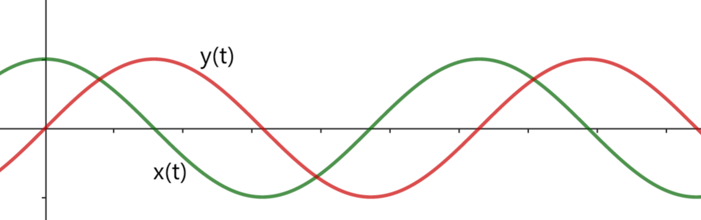
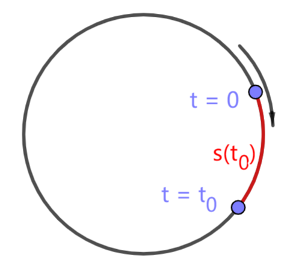
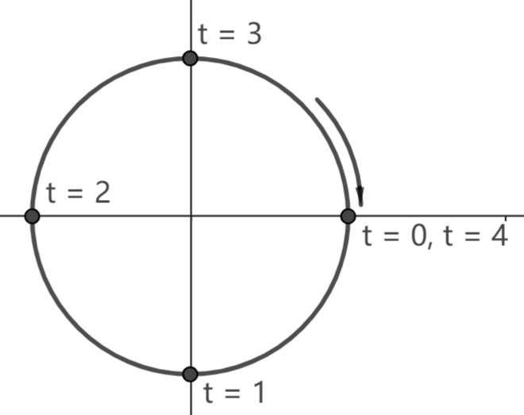

# 3.3 平面运动

在平面运动中，点的位置由二维坐标 $(x,y)$ 描述，我们将向量 $\vec r=(x,y)$ 称为点的 **位置向量**，点在 $t$ 时间的位置向量记作 $\vec r(t)$。点在两个时间点 $t_1<t_2$ 的位置向量之差 $\vec r(t_2)-\vec r(t_1)$ 称为点在 $t_1<t<t_2$ 时间段的 **位移**，记作 $\Delta\vec r$。

为了直观展现平面上点的运动情况，我们尝试分别作出 $x$-$t$ 和 $y$-$t$ 图象。下图是一个在固定圆周上运动的点的 $x$-$t$ 图象和 $y$-$t$ 图象。尽管这样的图象能展现部分运动情况，但我们最关心的运动轨迹、运动速度等信息很难在 $x$-$t$、$y$-$t$ 图象上展现出来。

## 3.3.1 路程

平面运动中，我们可以用运动轨迹的长度来描述点的运动情况。下图是一个圆周运动，在运动轨迹上取 $t=0$ 对应点作为坐标原点，沿运动轨迹建立坐标系，称为 **自然坐标系**。在自然坐标系中，点在 $t_0$ 时的位置由 $0<t<t_0$ 时间段的轨迹长度来表示，称为点在 $t_0$ 时的 **路程**，记作 $s(t_0)$。规定 $t>0$ 时 $s(t)$ 非负，$t<0$ 时 $s(t)$ 非正。

将 $t_1<t<t_2$ 时间段的轨迹长度称为点在 $t_1<t<t_2$ 时间段的路程，记作 $\Delta s=s(t_2)-s(t_1)$。

由定义可以知道，任意一段时间内，无论点如何运动，路程都不会小于 $0$；当且仅当点在这段时间内保持静止时，路程为 $0$。

平面运动中，衡量运动情况的指标主要是路程和位移。二者主要有以下区别：
- 路程是数量，衡量运动轨迹的长度；位移是向量，衡量始末位置的变化量；
- 若始末位置固定，路程受运动轨迹影响，而位移与运动轨迹无关，只与始末位置有关；
- 无论点怎样运动，路程不会减小，而位移的大小可能增大、减少或保持不变。

通常情况下，一段时间内路程和位移的大小不相等，二者的大小仅在单向直线运动中相等。

## 3.3.2 速率和速度

在直线运动中，我们定义速度是位置随时间的变化率。而平面运动中我们有路程和位移两个指标来衡量点的位置变化。对这两个指标，我们可以定义两种速度。

在 $t_0$ 时，路程 $s(t)$ 随时间 $t$ 的瞬时变化率称为点在 $t_0$ 时的 **速率**，记作 $v(t_0)$。位置 $\vec r(t)$ 随时间 $t$ 的瞬时变化率称为点在 $t_0$ 时的 **速度**，记作 $\vec v(t_0) = (v_x(t_0),v_y(t_0))$，其中 $v_x,v_y$ 分别为 $x,y$ 随时间 $t$ 的变化率。类似地可以定义速度随时间的变化率为加速度 $\vec a=(a_x,a_y)$。

我们对速率和速度的记法基本一致，这是因为二者有着密切的联系。

> 在平面运动中，任意时刻速度的 **大小** $|\vec v|$ 与速率 $v$ 是相等的。
>
> 速度的 **方向** 与运动轨迹上对应点处的 **切线方向** 共线。

## 习题

1. 如图，平面上一点在单位圆上运动，图中标注了该点在几个时间点的位置。
   1. 求 $0<t<1$ 时间段的路程和位移；
   2. 求 $0<t<2$ 时间段的路程和位移；
   3. 求 $0<t<4$ 时间段的路程和位移。

    
