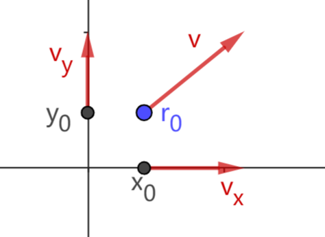
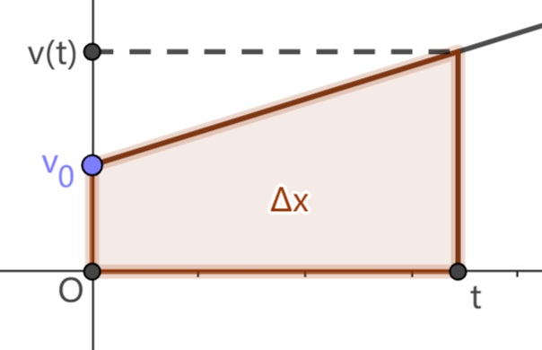
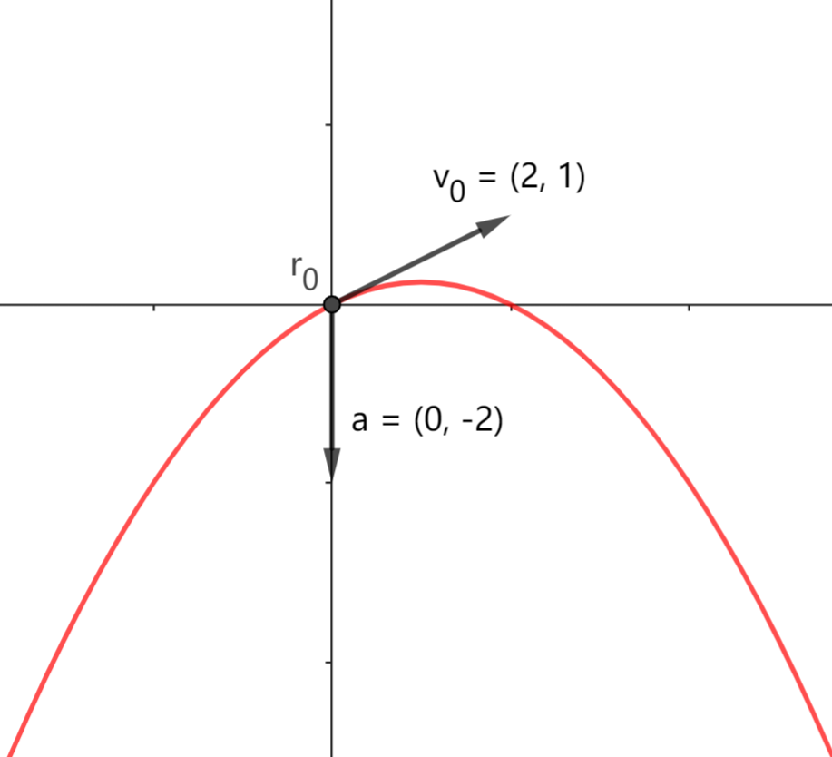
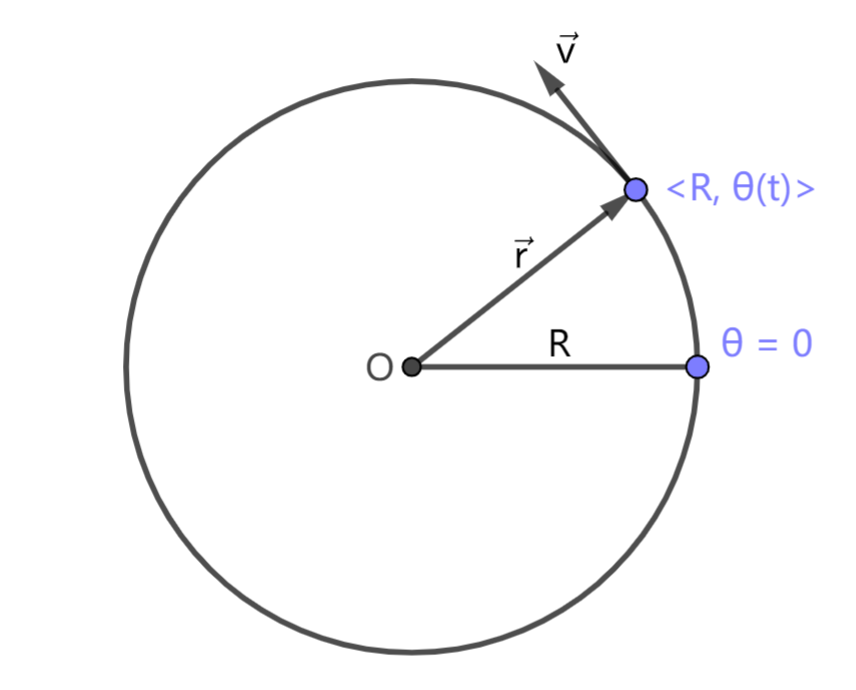
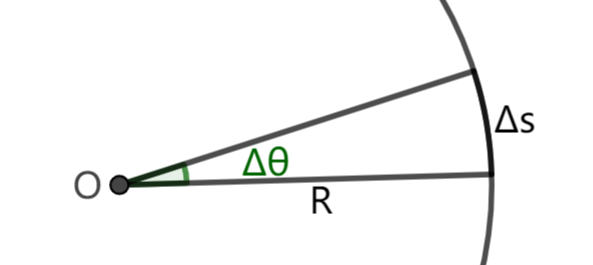
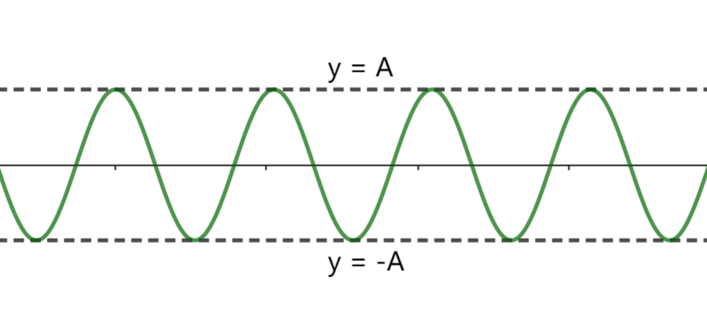
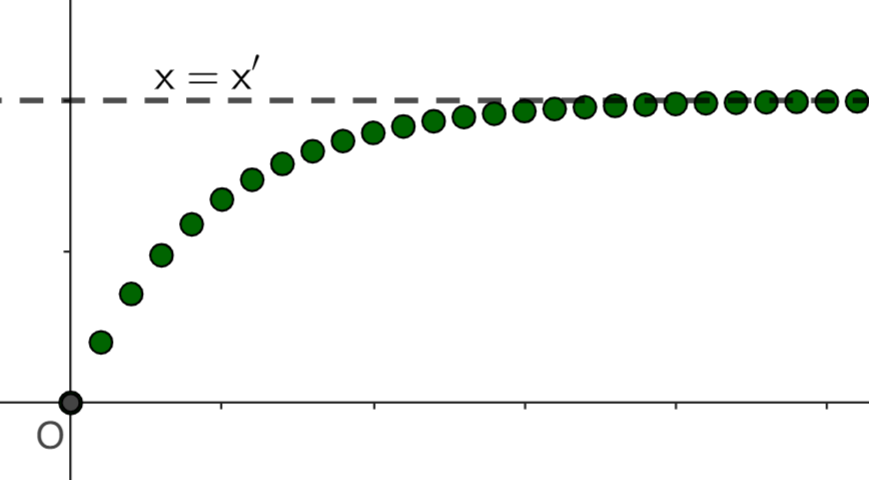
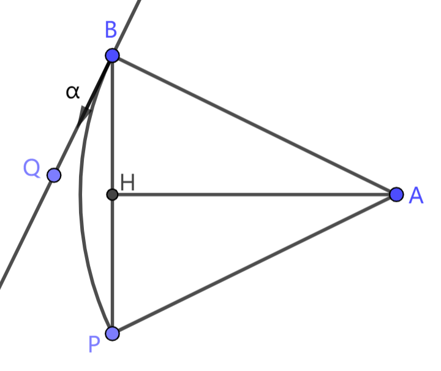

# 3.4 几种基础的运动模型

这一节将介绍一些相对基本的运动模型，它们将成为我们分析更复杂运动的基础。

## 3.4.1 匀速直线运动

我们已经讨论过一维坐标的匀速直线运动，现在在平面上重新考察匀速直线运动。

设匀速直线运动的初始位置为 $\vec r_0=(x_0,y_0)$，速度为 $\vec v=(v_x,v_y)$，则有
$$ \vec r(t) = \vec r_0 + \vec vt $$

写成坐标形式为
$$
x(t) = x_0 + v_x t \\
y(t) = y_0 + v_y t \\
$$

我们发现位置的横纵坐标各自满足一维的匀速运动形式。这就是说，平面上做匀速直线运动的点，在 $x$ 轴、$y$ 轴上的投影各自做匀速直线运动 (或静止)。

## 3.4.2 匀变速直线运动

匀变速直线运动是速度随时间均匀变化，即 **加速度恒定** 的直线运动。

设匀变速直线运动的初始位置为 $x_0$，初速度为 $v_0$，加速度为 $a$。由于速度随时间均匀变化，套用匀速直线运动结论可得，
$$ v(t)=v_0+at $$

如下图，匀变速直线运动的 $v$-$t$ 图象是一条直线。在 `3.2` 节我们介绍了由 $v$-$t$ 图象计算位移的方法。取一时间点 $t$，从初始时间到该时间的位移 $\Delta x=x(t)-x_0$ 即为图示梯形的面积。由梯形面积公式有，$\Delta x = \dfrac 12(v_0+v(t))t$，于是
$$
x(t) = x_0 + v_0t + \dfrac 12 at^2
$$

## 3.4.3 抛体运动

抛体运动是 **加速度恒定** 且不为 $\vec 0$ 的平面运动。

设抛体运动的初始位置为 $\vec r_0=(x_0,y_0)$，初速度 $\vec v_0=(v_{0x},v_{0y})$，加速度 $\vec a=(a_x,a_y)$。由于 $\vec a$ 恒定，$\vec a$ 在 $x,y$ 轴的分量 $a_x,a_y$ 也恒定。于是，点在 $x,y$ 轴的投影 $x(t),y(t)$ 符合匀变速直线运动的形式。所以有
$$
x(t) = x_0 + v_{0x}t + \dfrac 12 a_xt^2 \\
y(t) = y_0 + v_{0y}t + \dfrac 12 a_yt^2 \\
$$

向量形式为
$$
\vec r(t) = \vec r_0 + \vec v_0 t + \dfrac 12 \vec a t^2
$$

抛体运动的轨迹是怎样的呢？当 $\vec v_0,\vec a$ 共线时，点将在一条直线上运动，此时抛体运动退化为匀变速直线运动。$\vec v_0,\vec a$ 不共线时，抛体运动的轨迹是一种曲线，称为抛物线。

## 3.4.4 圆周运动

圆周运动是点在固定圆周上的运动。如图，平面上一点在圆心为原点、半径为 $R$ 的圆上运动。点的位置可以由方位角 $\theta$ 确定，有 $\vec r = \langle R,\theta(t)\rangle$。

我们将 $\theta(t)$ 称为点在 $t$ 时的 **角位置**，$\theta(t)$ 对时间 $t$ 的变化率称为 **角速度**，记作 $\omega(t)$。

接下来我们讨论圆周运动的速度，分为大小和方向两个方面。为了讨论方便，我们假设点在圆周上始终做逆时针运动，即 $\omega(t)\ge 0$。

曲线运动在某点的运动方向与运动轨迹在该点的切线方向共线。对圆周运动而言，圆的切线有一个性质：

> 对圆上一点 $P$，圆在 $P$ 处的切线与圆心到 $P$ 的连线垂直。

于是可知，圆周运动的速度和位置向量满足
$$ \vec v(t) \perp \vec r(t) $$

速度的大小，即速率，是路程随时间的变化率。如下图，在 $\Delta t$ 时间段内，点的路程为 $\Delta s$，角位移为 $\Delta\theta$。根据圆弧的几何性质，有 $\Delta s = R\Delta\theta$ (见 `1.6` 节弧度制)，即 $\dfrac{\Delta s}{\Delta t}=R\dfrac{\Delta\theta}{\Delta t}$。速率由 $\dfrac{\Delta s}{\Delta t}$ 定义，角速度由 $\dfrac{\Delta\theta}{\Delta t}$ 定义，于是有
$$ v = R\omega $$

确定了速度大小和方向，我们可以写出速度的坐标表示：
$$
\vec v(t) = 
\langle
    R\omega(t),\ \theta(t) + 90\degree
\rangle
$$

如果运动的角速度恒定为 $\omega$，这样的圆周运动称为匀速圆周运动。根据上式，运动速率恒定为 $R\omega$，有
$$
\vec v(t) = 
\langle
    R\omega,\ (\theta_0 + 90\degree) + \omega_0t
\rangle
$$

将 $\vec v(t)$ 视为动点，该点也符合匀速圆周运动的形式，由此可知 $\vec v(t)$ 对时间的变化率，即加速度
$$
\begin{array}{rl}
    \vec a(t) &= 
    \langle
        R\omega^2,\ (\theta_0+180\degree) + \omega_0t
    \rangle
    \\ &=
    - \langle
        R\omega^2,\ \theta(t)
    \rangle
    \\ &=
    -\vec r(t)\ \omega^2
\end{array}
$$

匀速圆周运动是周期性的运动，**周期** 为绕圆运动一圈所需的时间，记作 $T$。
$$
T = \dfrac{2\pi R}{v} = \dfrac{2\pi R}{R\omega} = \dfrac{2\pi}{\omega}
$$

周期的倒数称为 **频率**，记作 $f=\dfrac 1T$。

## 3.4.5 简谐振动

简谐振动是基本的一种振动模型。它是一种直线运动，存在一个固定的平衡位置，点在平衡位置附近的一段区域往复运动。设平衡位置为原点，简谐运动的通式为
$$ x(t) = A\cos(\omega t + \phi) $$

简谐振动的 $x$-$t$ 图象如下图所示，该曲线称为余弦波 (或正弦波，因为 $x(t)$ 可以转化为 $A\sin(\omega t + \phi')$ 的形式)。

简谐运动可以看作匀速圆周运动在 $x$ 轴上的投影。设有一点作匀速圆周运动，圆心为原点，半径为 $A$，初始角位置为 $\phi$，角速度为 $\omega$，则
$$
\vec r(t) = (x(t),y(t)) =
\langle
    A,\ \omega t + \phi
\rangle
\\
x(t) = A\cos(\omega t + \phi)
$$

匀速圆周运动的 $x(t)$ 与简谐运动形式一致。所以在研究简谐振动时，我们经常借助匀速圆周运动模型。

在简谐振动 $x(t) = A\cos(\omega t + \phi)$ 中，$A$ 决定了点与平衡位置的最大距离，称为运动的 **振幅**；$\omega$ 决定了振动的周期、频率等属性，称为运动的 **角频率**；$\omega t+\phi$ 影响点到平衡位置的距离，称为 $t$ 时刻的 **相位**；$\phi$ 是 $t=0$ 时的相位，称为 **初相位**。

简谐振动的周期与对应的匀速圆周运动的周期相同，为 $T=\dfrac{2\pi}{\omega}$。速度 $v(t)$ 是匀速圆周运动的速度在 $x$ 轴的分量，即
$$
v(t) = \omega A\cos(\omega t + \phi+90\degree) = -\omega A\sin(\omega t + \phi)
$$

加速度同理，有
$$
a(t) = -\omega^2 x(t) = -\omega^2 A\cos(\omega t + \phi)
$$

## 3.4.6 指数逼近

指数逼近是一类经典的逼近模型，由于容易实现且灵活，在子机跟随等场景中得到应用。

以直线运动为例，假设初始位置为 $x_0$，要让该点向某一位置 $x'$ 逼近。首先我们指定一个常数 $a\ (0<a<1)$，然后从 $t=0$ 开始进行如下递推：
$$ x(t+1) = x(t) + (1-a)(x'-x(t)) $$

下图是 $x_0=0,\ x'=10,\ a=0.8$ 时运动的 $x$-$t$ 图象。观察到，当点距目标位置 $x'$ 较远时，点快速向目标位置靠近；随着点与目标位置不断接近，运动的速度逐渐减小。点永远不会真正到达目标位置，即使运动足够长的时间，与目标位置仍会有一个很小的差距。不过当差距足够小时，我们就近似认为点到达目标位置。

对于上述递推式，可以验证
$$ x(t) = (x_0 - x')\cdot a^t + x' $$

将 $t$ 拓展到任意实数，有速度
$$ v(t) = v(0)\cdot a^t $$

点的运动速度也是指数逼近 $0$ 的。

## 习题

1. 设平面上有一点作匀速圆周运动，如下图，该点从点 $B$ 处出发，沿圆弧运动至点 $P$，圆弧的圆心为点 $A$，过点 $A$ 作 $AH \perp BP$。
   1. 若运动速率为 $9$ 像素/帧，圆弧半径为 $700$ 像素，求运动的角速度 (精确至小数点后两位，单位：度/帧)；
   2. 设圆弧半径 $R$ 已知，点 $B,P$ 坐标已知，求运动的初始方向 $\alpha$。(提示：$|BH|=|PH|,\ \angle{QBP}=\angle{BAH}=\angle{HAP}$)

    

2. 对 `3.4.6` 节讨论的指数逼近模型，设初始位置为 $x=1$，目标位置为 $x=0$，即 $x(t)=a^t$。要使点在 $t=T$ 时逼近到 $x=d$，求 $a$ 的值。