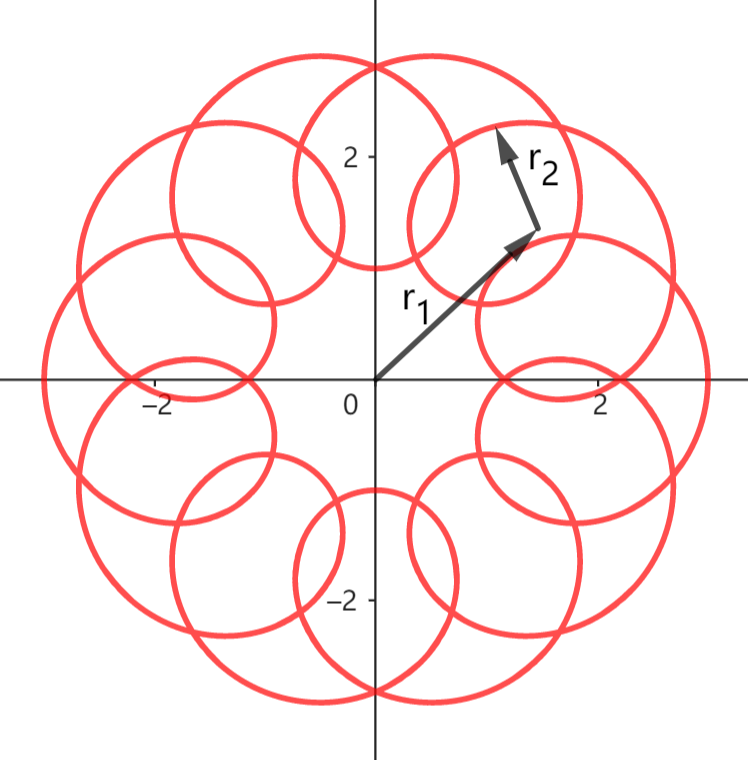

# 3.5 运动的合成与分解

我们可以利用基础的运动模型构造较复杂的运动。一种容易实现的构造方式是 **分段运动**，即在不同的时间段做不同类型的运动。这不是我们重点关注的内容，我们这一节介绍另一种构造方法：运动的合成。

## 3.5.1 合运动与分运动

设有平面运动 $\vec r_1(t),\cdots,\vec r_n(t)$，运动 $\vec r(t)=\vec r_1(t)+\cdots+\vec r_n(t)$ 称为这些运动的 **合运动**，$\vec r_1(t),\cdots,\vec r_n(t)$ 称为 $\vec r(t)$ 的一组 **分运动**。

例：设有两个匀速圆周运动 $\vec r_1(t)=\langle 2,t \rangle,\ \vec r_2(t)=\langle 1,11t \rangle$，合运动
$$
\vec r(t) =
\langle
    2,t
\rangle
+
\langle
    1,11t
\rangle
$$
运动轨迹如下图。我们看到，两个简单运动的合运动混杂了各个分运动的一些特征，表现出复杂的运动情况。

合运动的速度等于各分运动的速度之和。

运动的分解不是唯一的，在实际应用中，我们常采用两种思路分解一个运动：正交分解和按运动效果分解。

## 3.5.2 正交分解

正交分解是将运动分解为两条垂直直线上的若干直线运动。这是一种泛用的分解方式。一种经典的正交分解是把运动 $\vec r(t)$ 分解为 $x,y$ 轴上的两个直线运动 $\vec r_x(t),\vec r_y(t)$，其中
$$
\vec r_x(t) = x(t)\ \^i,\quad \^i=(1,0) \\
\vec r_y(t) = y(t)\ \^j,\quad \^j=(0,1) \\
$$

例：圆周运动 $\vec r(t) = \langle 1,t \rangle$ 可以正交分解为两个简谐运动 $\vec r_x(t) = \^i\cos(t),\ \vec r_y(t) = \^j\sin(t)$。

## 3.5.3 按运动效果分解

按运动效果分解是结合运动特征的分解方式，没有固定的模式和方法，对经验有一定要求。

示例见附带工程符卡 龙纹弹。