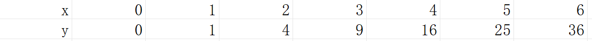
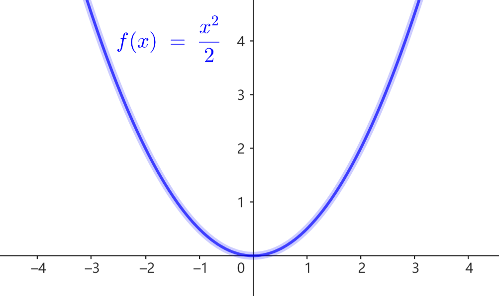

# 4.2 函数

`Tips：若感到本章难以阅读，可尝试直接阅读下一章。`

此处讨论的是数学上的函数，不是编程的。

## 4.2.1 函数的定义

函数描述了变量间的某种特殊关系：

对于两个变量 $x,y$，如果按照规则 $f$，对一定范围内的任意 $x$ 值，存在唯一 $y$ 值与之对应，则称 $x,y$ 之间有 **函数关系** $y=f(x)$。

$f$ 称为函数名，$x$ 称为函数的 **自变量**，其取值范围称为函数的 **定义域**，$y$ 称为函数的 **因变量**，其取值范围称为函数的 **值域**。

直线运动中，位置 $x$ 与时间 $t$ 就满足函数关系，所以我们在运动学用 $x=x(t)$ 来表示运动情况。

## 4.2.2 函数的表示

函数的表示方法主要有列表法、图象法、表达式法。

### 列表法

列表法将所有的自变量取值和对应的因变量取值列在表格中。这种方法适用于自变量只取有限多个值的函数。

通常我们讨论的函数都是连续取值的，很少使用列表法。

### 图象法

将所有的 $(x,y)$ 取值对绘制到平面直角坐标系上，组成的曲线称为函数的 **图象**。

### 表达式法

用只与自变量 $x$ 相关的数学表达式表示 $y=f(x)$，称为函数的 **表达式**。如上图中 $f(x)=\dfrac{x^2}{2}$ 就是函数 $f$ 的表达式。

## 4.2.3 分段函数

分段函数是将函数的定义域分为几段，在不同段使用不同表达式的函数表示方法。例如
$$
f(x)=
\begin{cases}
    3x+1, & x>-1 \\
    2x, & x\le-1 \\
\end{cases}
$$

对大于 $-1$ 的自变量 $x$，按照 $f(x)=3x+1$ 计算因变量的值，否则按照 $f(x)=2x$ 计算因变量的值。

## 4.2.4 向量函数

通常我们所讨论的函数是单自变量、单因变量的。广义上，我们也使用一些多自变量、多因变量的函数，比如 `Dist`, `Angle`。

对定义域内的一组自变量 $(x_1,\cdots,x_n)$，按照规则 $f$，在值域内有唯一确定的一组因变量 $(y_1,\cdot,y_m)$ 对应，则 $f$ 为函数关系，记作
$$
(y_1,\cdots,y_m) = f(x_1,\cdots,x_n)
$$
或向量形式
$$ \vec y = f(\vec x) $$