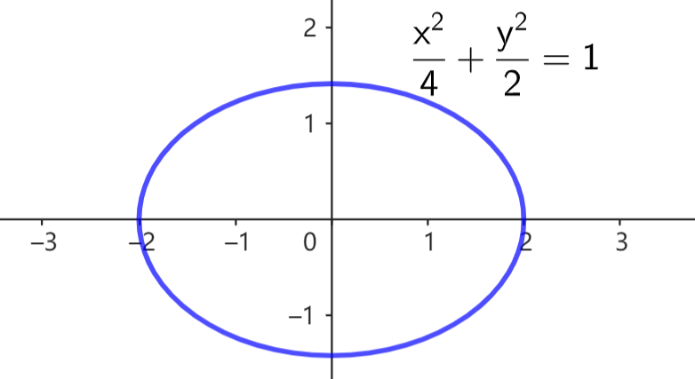
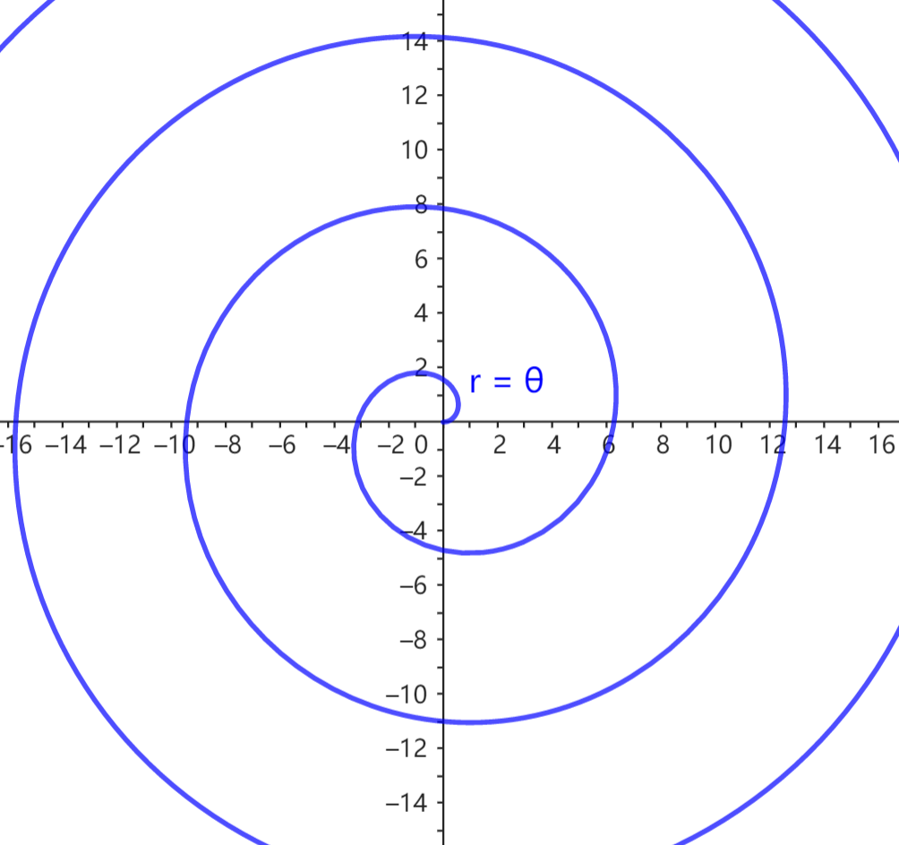
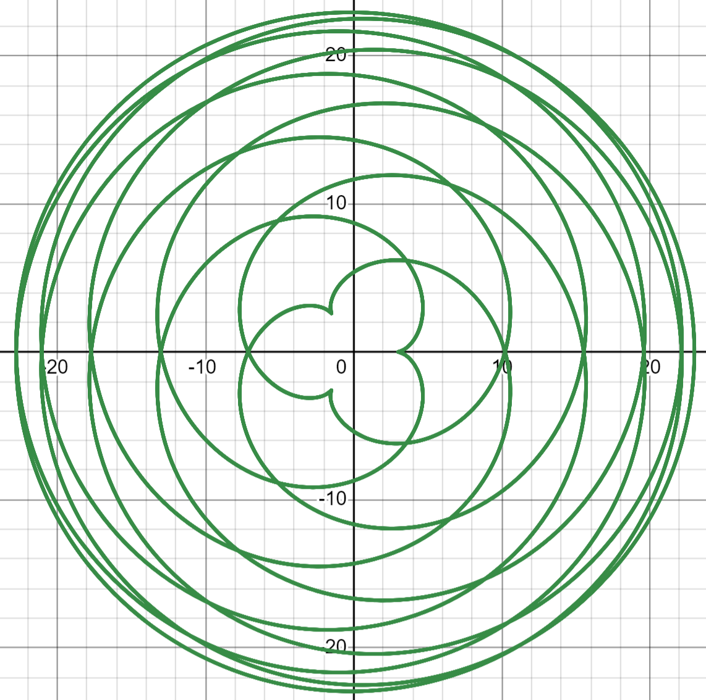

# 4.3 常见的曲线方程类型

`Tips：若感到本章难以阅读，可尝试直接阅读下一章。`

这一节简单介绍一些曲线方程类型，为下一章介绍具体曲线的方程铺垫。

## 4.3.1 函数

函数 $y=f(x)$ 用横纵坐标的函数关系来描述曲线。这种表示形式在中学阶段十分常见。

然而，这种形式要求曲线上点的横纵坐标首先必须满足函数关系，即对于任一 $x$，最多有一个 $y$ 对应。这使得该形式在描述曲线上的实用性不高 (比如圆就不满足函数关系)。

$y=f(x)$ 常用于弹幕的横坐标容易控制的情况。当纵坐标更容易控制时，可以考虑 $x=g(y)$ 的形式。

## 4.3.2 一般方程

一般方程 $F(x,y)=0$ 用横纵坐标的方程表示曲线，方程的一个解对应曲线上的一个点。高中阶段经常使用一般方程表示曲线，比如圆 $x^2+y^2=R^2$，椭圆 $\dfrac{x^2}{a^2}+\dfrac{y^2}{b^2}=1$ 等。

尽管一般方程比函数对曲线的限制更少，能够描述更多的曲线，但一般方程很难用于弹幕制作。在通常的应用场景中，我们需要生成曲线上点的坐标，这在方程中表现为求曲线方程的解，而求解一般方程通常并不容易。

相对地，一般方程更适合判断某点是否在某曲线上，将该点坐标代入方程判断是否满足即可。

## 4.3.3 极坐标方程

极坐标方程用极坐标形式描述曲线。通常我们只研究极径 $r$ 与极角 $\theta$ 存在函数关系 $r=r(\theta)$ 的曲线。尽管这类曲线相对较少，但它们在弹幕中应用较多。

## 4.3.4 参数方程

参数方程引入一个额外参数 $t$，用 $x$-$t$、$y$-$t$ 的函数关系来描述曲线，形如
$$
\begin{cases}
    x=x(t) \\ y=y(t)
\end{cases}
$$

参数方程在弹幕制作中十分常用，这有许多方面的原因：

- 参数方程的形式与平面运动形式一致。我们可以把参数看作平面运动的抽象。在实际应用中，参数 $t$ 经常表现为与时间有关 (有时甚至直接表示时间)，$t$ 也可以有其他的含义，比如与某些几何属性有关。
- 参数方程能描述的曲线很广泛，它兼容函数 $y=f(x)$：$x=t,\ y=f(t)$，兼容极坐标方程 $r=r(\theta)$：$x=r(t)\cos(t),\ y=r(t)\sin(t)$。参数方程还能描述一些用一般方程难以描述的曲线。
- 参数方程容易生成曲线上的点。只需代入一个 $t$ 值，就能得到曲线上一点的坐标 $(x(t),y(t))$。同时，由于参数 $t$ 通常有明确的含义，我们较容易按实际需求构造满足特定条件的点。

参数方程也有它的缺点，如果我们要判定平面上一点 $(x_0,y_0)$ 是否在曲线上，就需要判断方程 $x(t)=x_0,\ y(t)=y_0$ 对变量 $t$ 是否有解。这是相对困难的。

为了简化表述，我们可以将参数方程记为向量形式 $\vec r = \vec r(t)$。比如参数方程
$$
\begin{cases}
    x = 13\cos(t) -10\cos(\dfrac{13}{10}t) \\
    y = 13\sin(t) -10\sin(\dfrac{13}{10}t) \\
\end{cases}
$$
可以记为
$$
\vec r = 
\langle 13,t \rangle
-
\langle 10,\dfrac{13}{10}t \rangle
$$

