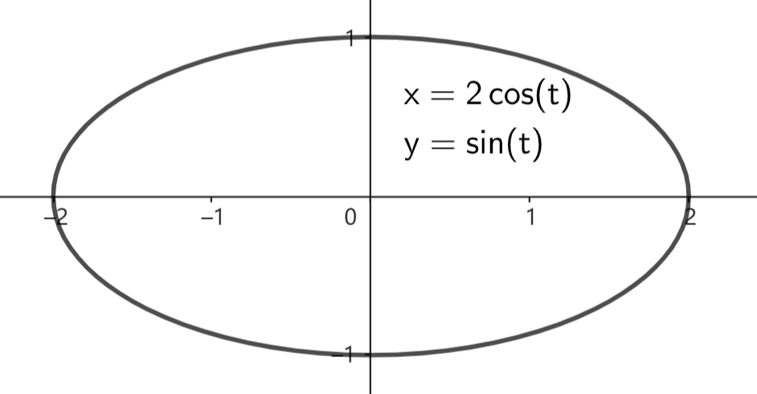
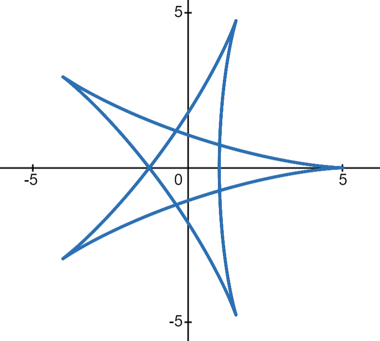
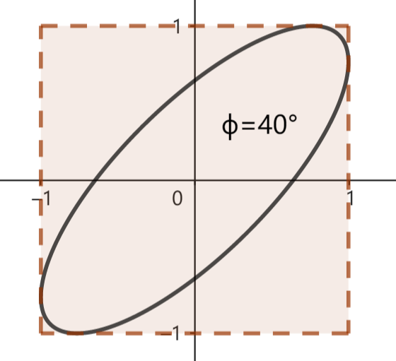

# 5.3 椭圆

我们主要讨论椭圆的参数方程，高中阶段椭圆有其他的方程，但在弹幕中的应用极小，本教程不进行讨论。

---

$
\begin{cases}
    x = a\cos(t) \\
    y = b\sin(t) \\
\end{cases}
$，$a,b$ 为定值，$a>b$

我们对椭圆的讨论从这个参数方程开始。该方程描述了一个中心点为原点，水平放置的椭圆。

我们称该椭圆的半长轴长为 $a$，半短轴长为 $b$。

> 平面旋转公式：将平面上一点 $P(x,y)$ 绕原点逆时针旋转 $\phi$ 角，得到点 $P'(x',y')$，则有
> $$
x' = x \cos(\phi) - y \sin(\phi) \\
y' = x \sin(\phi) + y \cos(\phi) \\
> $$

将上述椭圆方程代入平面旋转公式可得斜椭圆方程：
$$
\begin{cases}
    x = a\cos(t)\cos(\phi) - b\sin(t)\sin(\phi) \\
    y = a\cos(t)\sin(\phi) + b\sin(t)\cos(\phi) \\
\end{cases}
$$

式中 $a,b$ 分别为椭圆的半长轴长、半短轴长，$\phi$ 为椭圆的倾斜角，椭圆的中心为原点。

---

$\vec r = 
\langle R_1,\alpha + t \rangle
+
\langle R_2,\alpha - t \rangle
$
($R_1,R_2,\alpha$ 为定值，$R_1>R_2$)

坐标形式：
$
\begin{cases}
    x = R_1\cos(\alpha+t) + R_2\cos(\alpha-t) \\
    y = R_2\sin(\alpha+t) + R_2\sin(\alpha-t) \\
\end{cases}
$

该方程描述了一个中心为原点，半长轴长为 $R_1+R_2$，半短轴长为 $R_1-R_2$，倾斜角为 $\alpha$ 的斜椭圆。该方程与由平面旋转公式推导的椭圆方程等价。

从该方程我们看到，如果两个匀速圆周运动半径不等，角速度互为相反数，那么这两个运动的合运动轨迹为椭圆。

这种由向量叠加构建曲线的方法，是参数方程的特色。改变两个分运动的角速度之比，以及改变分运动的数目，可以构造多种多样的曲线。

曲线
$\vec r = \langle 3,2t \rangle + \langle 2,-3t \rangle$：

---

$
\begin{cases}
    x = \cos(t) \\
    y = \cos(t+\phi) \\
\end{cases}
$

该方程描述了一类倾斜角为 $45\degree$ 或 $135\degree$ 的椭圆，它们与图示正方形内切。定值 $\phi$ 与椭圆的扁平程度有关。

我们很少用该方程构造椭圆。不过该方程是 **利萨如图形** 的特例。利萨如图形是 $x,y$ 两个方向的简谐振动的合运动轨迹，通式为
$$
\begin{cases}
    x = \cos(\omega_1 t + \phi_1) \\
    y = \cos(\omega_2 t + \phi_2) \\
\end{cases}
$$