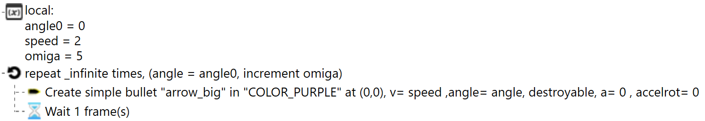
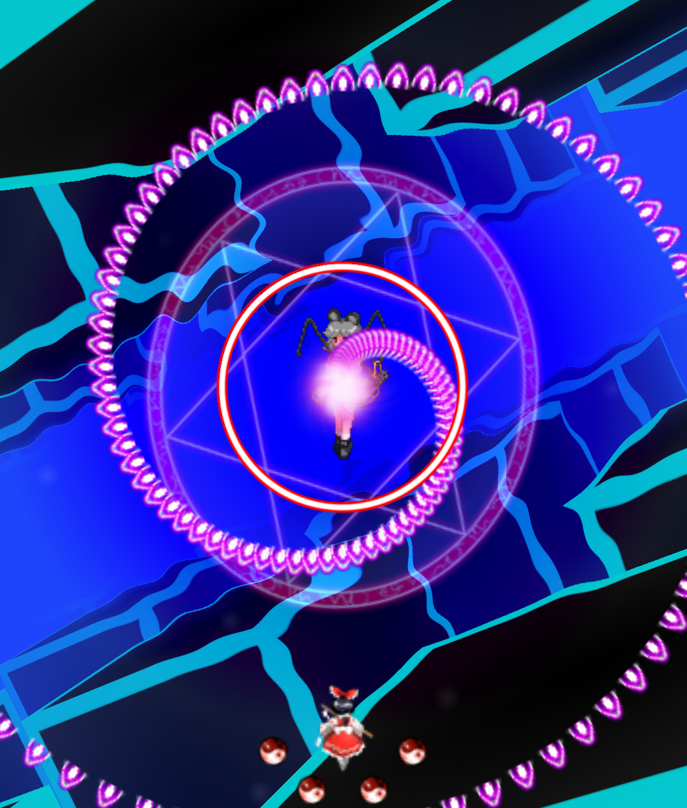
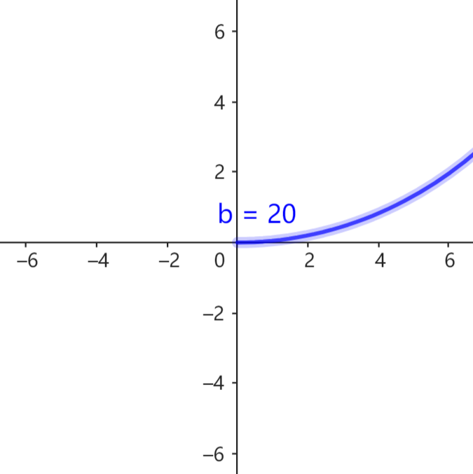
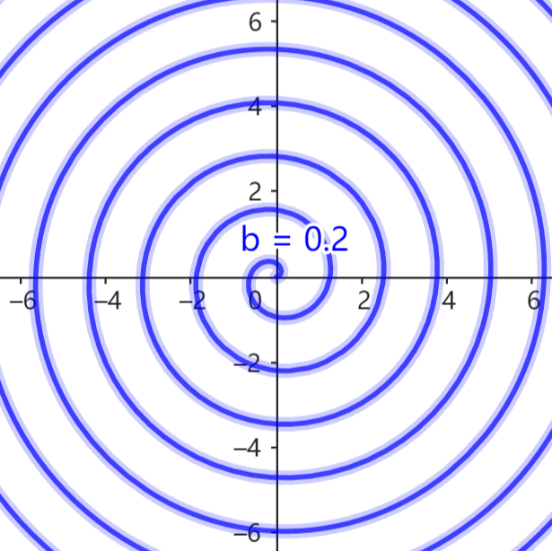
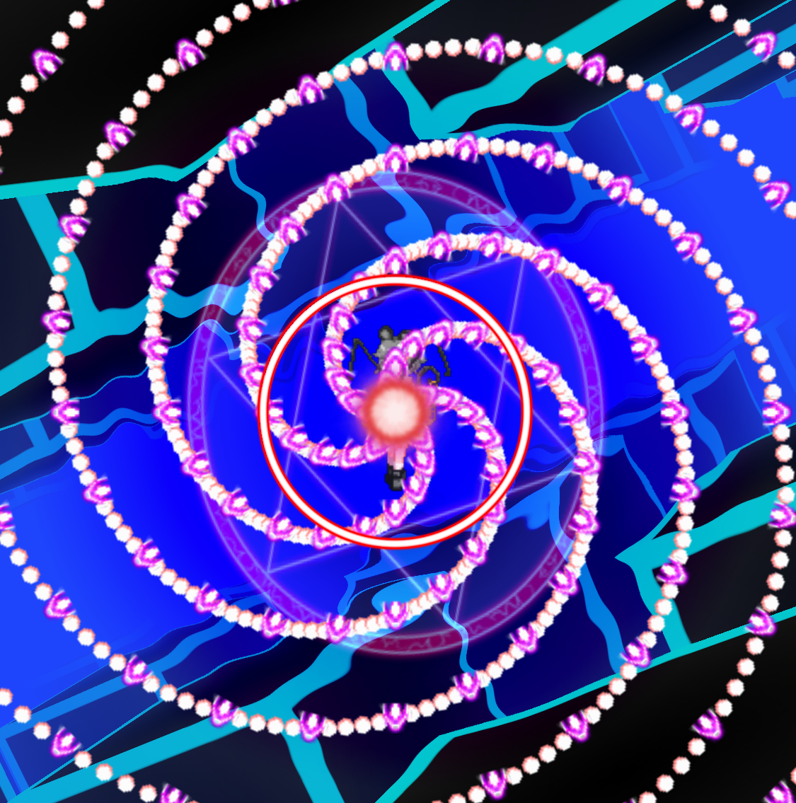

# 5.4 等速螺线

等速螺线是极坐标系上的曲线，极坐标方程为
$$ r = a + b\theta $$

式中 $r\ge0$，$\theta$ 取弧度值，$a,b$ 为定值，$b\neq0$。

等速螺线常见于简单风车弹，我们就以风车弹为例进行讨论。

图示程序创建一组 `1 way` 风车弹，发弹点固定为原点，初始发弹方向设为 $\alpha$，每帧发射弹速为 $v$ 的子弹 ($v$ 较小)，每次发弹角度增量设为 $\omega$ ($\omega$ 较小)。在 $t=T$ 时观察到子弹构成图示曲线。

对于 $t$ 时刻发射的子弹 ($0\le t\le T$)，发弹角度 $\theta(t)=\alpha+\omega t$，运动时间为 $T-t$，运动距离 $r(t)=v(T-t)$。于是曲线方程为
$$
\begin{cases}
    r = v(T-t) \\
    \theta = \alpha + \omega t \\
\end{cases}
$$

由 $\theta=\alpha+\omega t$ 有 $t=\dfrac{\theta-\alpha}{\omega}$，代入 $r(t)$ 得
$$
r = v(T-\dfrac{\theta-\alpha}{\omega})
= \left( -\dfrac{v}{\omega} \right) \theta
+ \left( vT + \dfrac{v\alpha}{\omega} \right)
$$

> 设 $a=vT+\dfrac{v\alpha}{\omega},\ b=-\dfrac{v}{\omega}$，则有 $r=a+b\theta$，符合等速螺线方程的形式。

对等速螺线 $r=a+b\theta\ (r\ge0)$，$a$ 影响螺线的整体旋转，而不改变螺线的整体形状；$b$ 影响螺线的疏密程度。

在一个固定尺度上观察等速螺线。如果 $b$ (的绝对值) 非常大，那么局部上螺线的极角变化很小，看起来近似于直线；如果 $b$ 非常小，那么局部上螺线的极角变化很大，看起来近似于一组同心圆。

为了衡量螺线的疏密程度，我们定义等速螺线的 **螺距**：以极点为端点任作一条射线，与等速螺线交于若干点，可以知道相邻两个交点的距离为定值，将该定值称为等速螺线的螺距。

我们说螺距越大，螺线越稀疏；螺距越小，螺线越密集。

> 对螺线 $r=a+b\theta$，螺距为 $2\pi |b|$。

现在我们可以分析风车弹参数对螺线形状的影响。

$b=-\dfrac{v}{\omega}$，所以弹速 $v$ 越小、角度增量 $\omega$ 越大，螺距就越小，螺线就越密集。

$a=vT+\dfrac{v\alpha}{\omega}$ 与 $T$ 呈线性关系，所以螺线随时间变化而不断匀速旋转。为了确定螺线的整体旋转情况，将方程写作 $r=b(\theta-\theta_0)$，其中 $\theta_0=-\dfrac{a}{b}=\omega T-\alpha$。$\theta_0$ 对 $T$ 的变化率为 $\omega$，所以螺线的旋转角速度确实为 $\omega$。

其实关于风车弹有一个很有趣的问题：当角度增量 $\omega$ 很大时，尽管对应的螺线总是变得更密集，但风车弹看起来不一定变得密集。

下图中紫色鳞弹是 $\omega=75\degree$ 的 `1 way` 风车，红色小弹是 $\omega=3\degree$ 的 `5 way` 风车。我们看到，它们的形状是一致的。很遗憾本教程暂时不会就这个问题进一步讨论，也许以后会更新？

