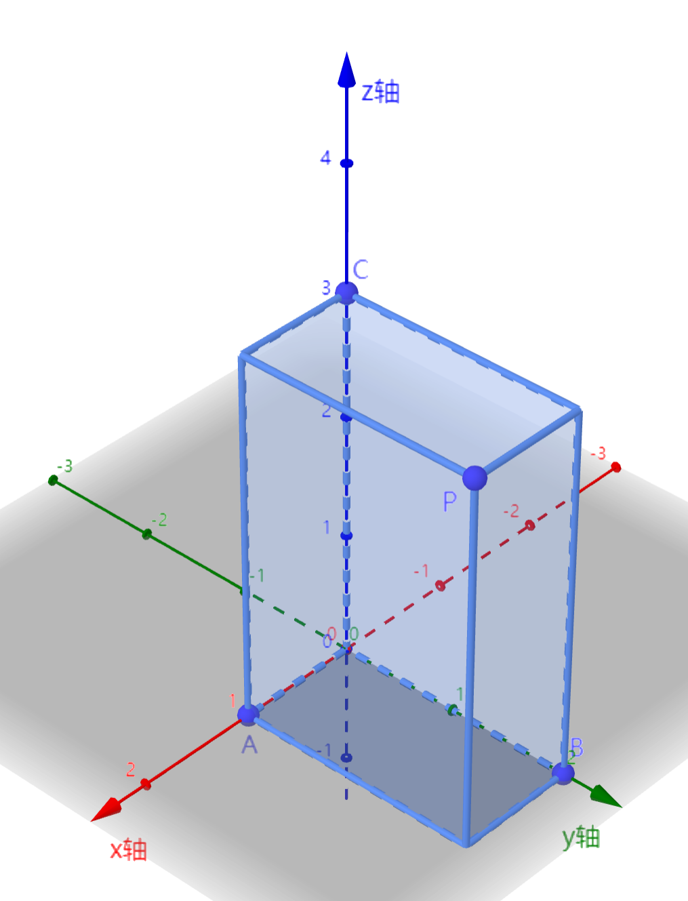
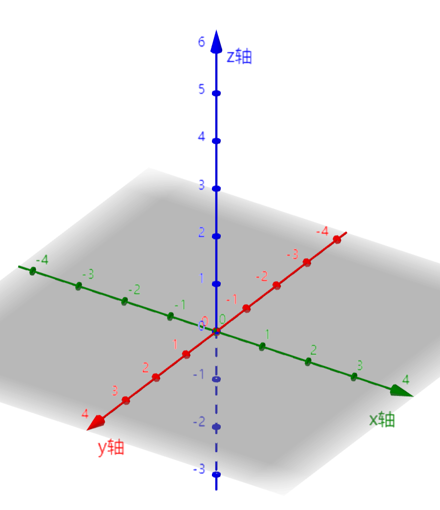
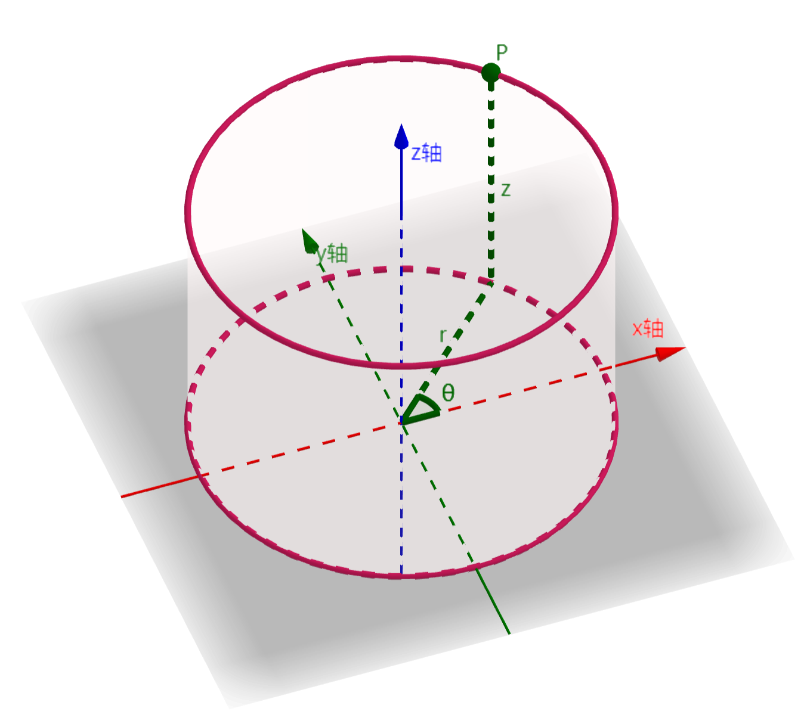
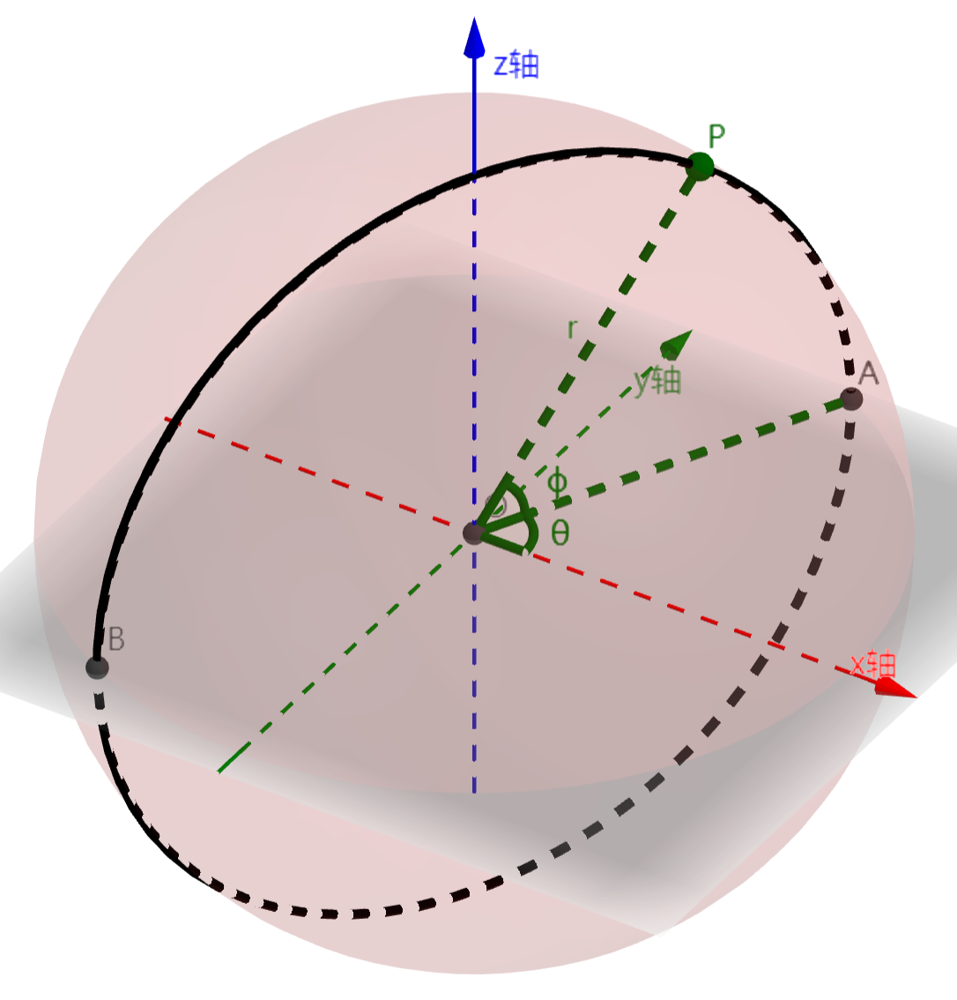

# 6.1 空间坐标系

这一章我们将讨论伪`3D`弹幕的基本数学原理，我们将把前五章讨论的内容拓展到三维空间中，从而帮助我们实现一些经典的伪`3D`弹幕。

首先，我们需要知道如何在三维空间中描述点的位置，也就是说，三维空间中我们可以建立什么样的坐标系。

## 6.1.1 空间直角坐标系

空间直角坐标系是平面直角坐标系在三维空间中的拓展。它由三条两两垂直的坐标轴构成，三条坐标轴有公共的原点 $O$。将三条坐标轴分别记作 $x,y,z$ 轴。该坐标系可以记作 $O$-$xyz$。任取两条坐标轴，可以确定一个坐标平面，由此可以确定三个坐标平面，记作 $xOy,yOz,zOx$ 平面。

与平面直角坐标系类似地，要确定空间中一点 $P$ 的位置，作如图所示的长方体，点 $A,B,C$ 在各自坐标轴上对应的数分别为 $x_P,y_P,z_P$，将有序数组 $(x_P,y_P,z_P)$ 称为点 $P$ 的直角坐标。

## 6.1.2 左手系与右手系

根据 $x,y,z$ 轴的相对位置，我们将空间直角坐标系分为 **右手系** (上图) 和 **左手系** (下图)。

在不同场景中，使用右手系还是左手系并无统一的规范。比如本教程使用的绘图软件 `GeoGebra` 只提供了右手系，而 `LuaSTG` 的 `3D` 背景使用左手系。

在三维空间中讨论旋转方向是一件麻烦的事情。很多时候我们会使用 "顺时针 / 逆时针" 的说法，然而 "顺时针 / 逆时针" 在左手系 / 右手系中究竟是什么方向的旋转，并无明确的规范。这使得不同资料对旋转的文字描述和公式描述有很大差异。

在本教程中，我们不使用顺时针 / 逆时针的说法，而是从坐标层面规定旋转的正方向。

首先我们规定 $x \rightarrow y \rightarrow z \rightarrow x \rightarrow\cdots$ 为 **正序**，$z \rightarrow y \rightarrow x \rightarrow z \rightarrow\cdots$ 为 **逆序**，这是各种资料基本认同的。在二维平面坐标系 $xOy$ 中对顺时针 / 逆时针的规定，各种资料基本一致。我们规定二维平面 $xOy$ 中，逆时针方向为正方向 (这是我们在之前的讨论中一直使用的)，将该方向称为 $x \rightarrow y$ 旋转方向。$xOy$ 上的顺时针方向为负方向，称为 $y \rightarrow x$ 旋转方向。

现在我们有 $x\rightarrow y,\ y\rightarrow x$ 方向的定义，类似地可以定义 $y\rightarrow z,\ x\rightarrow z$ 等方向。如果一个旋转方向包含在正序 $x \rightarrow y \rightarrow z \rightarrow\cdots$ 中，就称该方向是正序的，比如 $x\rightarrow y,\ z\rightarrow x$。否则，称该方向是逆序的。

接下来我们定义 "绕坐标轴旋转" 的正方向。我们称，绕一个坐标轴旋转的正方向为，另外两个坐标轴对应的正序旋转。具体地说，比如对于 $y$ 轴，绕 $y$ 轴旋转的正方向为 $z\rightarrow x$。

在这样的定义下，无论左手系还是右手系，旋转公式都是相同的。

## 6.1.3 柱坐标系

柱坐标系由 $xOy$ 平面上的极坐标 $r,\theta$ 和 $z$ 轴坐标 $z$ 确定点的位置。直角坐标 $(x,y,z)$ 与柱坐标 $(r,\theta,z)$ 的转换如下：
$$
x = r\cos(\theta) \\
y = r\sin(\theta) \\
z = z \\
r = \text{Dist}(x,y) \\
\theta = \text{Angle}(x,y) \\
$$

## 6.1.4 球坐标系

球坐标系由球半径和两个角度确定点的位置。为确定空间中一点 $P$ 的位置，作以原点为球心，过点 $P$ 的球面，设球半径为 $r$。参照地理中经纬度的含义，设点 $P$ 在球面上的经度为 $\theta$，纬度为 $\phi$，由 $r,\theta,\phi$ 可以确定点 $P$ 的位置。

球坐标 $(r,\theta,\phi)$ 与直角坐标 $(x,y,z)$ 有如下转换关系：
$$
x = r\cos(\phi)\cos(\theta) \\
y = r\cos(\phi)\sin(\theta) \\
z = r\sin(\phi) \\
r = \sqrt{x^2 + y^2 + z^2} \\
\theta = \text{Angle}(x,y) \\
\phi = \text{asin}\left(\dfrac zr \right)
$$

