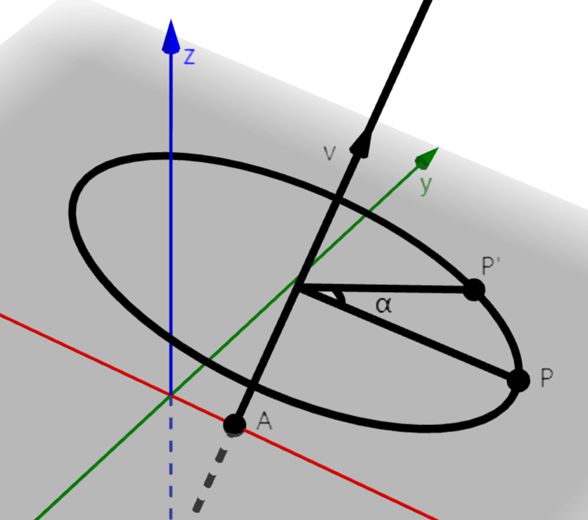
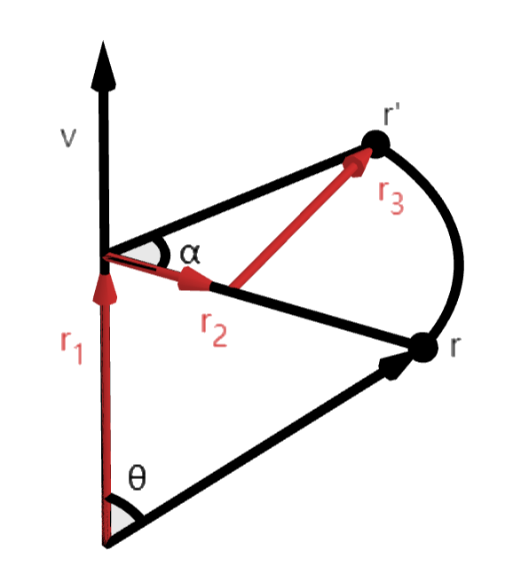

# 6.3 定轴旋转

这一节我们讨论空间向量的定轴旋转。如下图，已知空间中一点 $P$，将点 $P$ 绕一条直线 (旋转轴) 旋转一定角度 $\alpha$ ，得到点 $P'$。我们用直线上一点 $A$ 和直线的方向向量 $\vec v\ (|\vec v|=1)$ 表示该旋转轴。

对下图我们称，将向量 $\overrightharpoon{AP}$ 绕 **轴向量** $\vec v\ (|\vec v|=1)$ 旋转 $\alpha$ 角，得到向量 $\overrightharpoon{AP'}$。

## 6.3.1 绕坐标轴的旋转

向量绕坐标轴的旋转相对容易计算，只需套用平面旋转公式即可。比如，将 $\vec r=(x,y,z)$ 绕 $y$ 轴旋转 $\alpha$ 得到 $\vec r'=(x',y',z')$。

首先有 $y'=y$。将 $\vec r,\vec r'$ 投影到 $zOx$ 平面，得平面向量 $\vec r_{zx}=(z,x),\ \vec r_{zx}'=(z',x')$。代入平面旋转公式得
$$
z' = z\cos(\alpha) - x\sin(\alpha) \\
x' = z\sin(\alpha) + x\cos(\alpha) \\
$$

绕 $x,z$ 轴的旋转同理。

## 6.3.2 定轴旋转近似公式

轴向量不局限于坐标轴时，旋转计算将变得复杂，我们在 `6.3.3` 介绍具体公式。如果我们对精度要求非常低，可以使用下面的相对容易记忆的近似公式。

记 **轴角向量** $\vec\alpha=\alpha\cdot\vec v=(\alpha_x,\alpha_y,\alpha_z)$。我们将待旋转向量 $\vec r$ 依次绕 $x,y,z$ 轴旋转 $\alpha_x,\alpha_y,\alpha_z$，即得到近似结果。

该方法中，三次旋转的顺序不重要。旋转角 $\alpha$ 越接近 $0$、轴向量 $\vec v$ 越接近坐标轴，近似误差越小。

## 6.3.3 罗德里格斯旋转公式

下面我们给出一个精确计算定轴旋转的公式。将空间向量 $\vec r$ 绕单位向量 $\vec v$ 旋转 $\alpha$ 得 $\vec r'$，则
$$
\vec r' =
\vec r \cos(\alpha) +
(\vec v \times \vec r)\sin(\alpha) +
\vec v (\vec v \cdot \vec r)(1-\cos(\alpha))
$$

简单说明一下推导方法。

将 $\vec r'$ 分解为图示相互垂直的三个向量 $\vec r_1,\vec r_2,\vec r_3$ 之和。

$\vec r_1$ 与轴向量 $\vec v$ 同向，知道 $\vec r_1$ 大小就可以确定 $\vec r_1$。设 $\vec v,\vec r$ 夹角为 $\theta$，则有 $|\vec r_1|=|\vec r|\cos(\theta)$。由向量内积有 $\vec v\cdot\vec r=|\vec v||\vec r|\cos(\theta)=|\vec r|\cos(\theta)$，所以
$$ \vec r_1 = \vec v\cdot|\vec r_1| = \vec v(\vec v\cdot\vec r) $$

设 $\vec R=\vec r-\vec r_1$，则 $\vec r_2\parallel\vec R$。$|\vec R|$ 为图中圆弧的半径，因而有 $|\vec r_2|=|\vec R|\cos(\alpha)$。所以
$$ \vec r_2 = \vec R\cos(\alpha) = (\vec r-\vec v(\vec v\cdot\vec r))\cos(\alpha) $$

$\vec r_3$ 与 $\vec v,\vec r$ 都垂直，由向量外积的含义可知，$\vec r_3\parallel \vec v\times\vec r$。

计算两向量大小 $|\vec r_3|=|\vec R|\sin(\alpha),\ |\vec v\times\vec r|=|\vec v||\vec r|\sin(\theta)=|\vec r|\sin(\theta)=|\vec R|$。考虑 $\vec v\times\vec r$ 的方向，有
$$ \vec r_3 = (\vec v\times\vec r)\sin(\alpha) $$

将 $\vec r_1,\vec r_2,\vec r_3$ 相加即得 $\vec r'$。